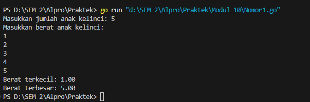
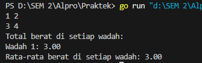
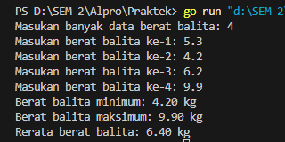

Modul 10

Nama : Adrian Ernest Troy Rawung
Kelas : IF-12-05
NIM : 103112430009

Nomor 1
```go
package main

  

import (

    "fmt"

)

  

func main() {

    var N int

  

    // Input jumlah anak kelinci

    fmt.Print("Masukkan jumlah anak kelinci: ")

    fmt.Scan(&N)

  

    // Validasi jumlah anak kelinci

    if N <= 0 || N > 1000 {

        fmt.Println("Jumlah anak kelinci harus antara 1 hingga 1000.")

        return

    }

  

    // Input berat anak kelinci

    weights := make([]float64, N)

    fmt.Println("Masukkan berat anak kelinci:")

    for i := 0; i < N; i++ {

        fmt.Scan(&weights[i])

    }

  

    // Inisialisasi nilai minimum dan maksimum

    minWeight := weights[0]

    maxWeight := weights[0]

  

    // Mencari berat terkecil dan terbesar

    for i := 1; i < N; i++ {

        if weights[i] < minWeight {

            minWeight = weights[i]

        }

        if weights[i] > maxWeight {

            maxWeight = weights[i]

        }

    }

  

    // Output hasil

    fmt.Printf("Berat terkecil: %.2f\n", minWeight)

    fmt.Printf("Berat terbesar: %.2f\n", maxWeight)

}
```
Penjelasan :
Program ini digunakan untuk mendata berat anak kelinci yang akan dijual ke pasar. Pertama, program meminta input jumlah anak kelinci ([N](vscode-file://vscode-app/c:/Users/Adrian%20Ernest/AppData/Local/Programs/Microsoft%20VS%20Code/resources/app/out/vs/code/electron-sandbox/workbench/workbench.html)) dan memvalidasi bahwa jumlah tersebut berada dalam rentang 1 hingga 1000. Jika tidak valid, program akan menampilkan pesan kesalahan dan berhenti. Selanjutnya, program meminta input berat masing-masing anak kelinci dan menyimpannya dalam array [weights](vscode-file://vscode-app/c:/Users/Adrian%20Ernest/AppData/Local/Programs/Microsoft%20VS%20Code/resources/app/out/vs/code/electron-sandbox/workbench/workbench.html). Setelah itu, nilai minimum ([minWeight](vscode-file://vscode-app/c:/Users/Adrian%20Ernest/AppData/Local/Programs/Microsoft%20VS%20Code/resources/app/out/vs/code/electron-sandbox/workbench/workbench.html)) dan maksimum ([maxWeight](vscode-file://vscode-app/c:/Users/Adrian%20Ernest/AppData/Local/Programs/Microsoft%20VS%20Code/resources/app/out/vs/code/electron-sandbox/workbench/workbench.html)) diinisialisasi dengan berat anak kelinci pertama. Program kemudian menggunakan loop untuk membandingkan setiap berat dalam array, memperbarui nilai minimum dan maksimum jika ditemukan berat yang lebih kecil atau lebih besar. Terakhir, program menampilkan berat terkecil dan terbesar dalam format dua angka di belakang koma. Program ini memastikan data berat anak kelinci dapat diolah dengan efisien dan memberikan hasil yang akurat.

Output:




Nomor 2
```go
package main

  

import (

    "fmt"

)

  

func main() {

    var x, y int

  

    // Input jumlah ikan (x) dan kapasitas wadah (y)

    fmt.Scan(&x, &y)

  

    // Input berat ikan

    weights := make([]float64, x)

    for i := 0; i < x; i++ {

        fmt.Scan(&weights[i])

    }

  

    // Menghitung total berat di setiap wadah

    var containers []float64

    var sum float64

    for i, weight := range weights {

        sum += weight

        if (i+1)%y == 0 || i == x-1 {

            containers = append(containers, sum)

            sum = 0

        }

    }

  

    // Output total berat di setiap wadah

    fmt.Println("Total berat di setiap wadah:")

    for i, container := range containers {

        fmt.Printf("Wadah %d: %.2f\n", i+1, container)

    }

  

    // Menghitung rata-rata berat di setiap wadah

    var total float64

    for _, container := range containers {

        total += container

    }

    average := total / float64(len(containers))

  

    // Output rata-rata berat

    fmt.Printf("Rata-rata berat di setiap wadah: %.2f\n", average)

}
```
Penjelasan:
Program ini digunakan untuk menghitung total berat ikan di setiap wadah dan rata-rata berat per wadah. Pertama, program meminta input jumlah ikan ([x](vscode-file://vscode-app/c:/Users/Adrian%20Ernest/AppData/Local/Programs/Microsoft%20VS%20Code/resources/app/out/vs/code/electron-sandbox/workbench/workbench.html)) dan kapasitas maksimum ikan per wadah ([y](vscode-file://vscode-app/c:/Users/Adrian%20Ernest/AppData/Local/Programs/Microsoft%20VS%20Code/resources/app/out/vs/code/electron-sandbox/workbench/workbench.html)), lalu berat masing-masing ikan disimpan dalam array [weights](vscode-file://vscode-app/c:/Users/Adrian%20Ernest/AppData/Local/Programs/Microsoft%20VS%20Code/resources/app/out/vs/code/electron-sandbox/workbench/workbench.html). Program menghitung total berat ikan di setiap wadah dengan menjumlahkan berat ikan hingga mencapai kapasitas [y](vscode-file://vscode-app/c:/Users/Adrian%20Ernest/AppData/Local/Programs/Microsoft%20VS%20Code/resources/app/out/vs/code/electron-sandbox/workbench/workbench.html) atau ikan terakhir, kemudian menyimpannya dalam array [containers](vscode-file://vscode-app/c:/Users/Adrian%20Ernest/AppData/Local/Programs/Microsoft%20VS%20Code/resources/app/out/vs/code/electron-sandbox/workbench/workbench.html). Setelah itu, program menampilkan total berat di setiap wadah. Selanjutnya, program menghitung rata-rata berat dengan menjumlahkan semua berat dalam [containers](vscode-file://vscode-app/c:/Users/Adrian%20Ernest/AppData/Local/Programs/Microsoft%20VS%20Code/resources/app/out/vs/code/electron-sandbox/workbench/workbench.html) dan membaginya dengan jumlah wadah. Akhirnya, program menampilkan rata-rata berat ikan per wadah. Program ini memastikan pengelompokan ikan ke dalam wadah dilakukan secara efisien.

Ouutput:




Nomor 3

```go
package main

  

import (

    "fmt"

)

  

type arrBalita [100]float64

  

// Fungsi untuk menghitung nilai minimum dan maksimum

func hitungMinMax(arrBerat arrBalita, n int, bMin, bMax *float64) {

    *bMin = arrBerat[0]

    *bMax = arrBerat[0]

  

    for i := 1; i < n; i++ {

        if arrBerat[i] < *bMin {

            *bMin = arrBerat[i]

        }

        if arrBerat[i] > *bMax {

            *bMax = arrBerat[i]

        }

    }

}

  

// Fungsi untuk menghitung rata-rata

func hitungRerata(arrBerat arrBalita, n int) float64 {

    var total float64 = 0

    for i := 0; i < n; i++ {

        total += arrBerat[i]

    }

    return total / float64(n)

}

  

func main() {

    var arrBerat arrBalita

    var n int

    var bMin, bMax float64

  

    // Input jumlah data berat balita

    fmt.Print("Masukan banyak data berat balita: ")

    fmt.Scan(&n)

  

    // Input berat balita

    for i := 0; i < n; i++ {

        fmt.Printf("Masukan berat balita ke-%d: ", i+1)

        fmt.Scan(&arrBerat[i])

    }

  

    // Hitung nilai minimum, maksimum, dan rata-rata

    hitungMinMax(arrBerat, n, &bMin, &bMax)

    rerata := hitungRerata(arrBerat, n)

  

    // Output hasil

    fmt.Printf("Berat balita minimum: %.2f kg\n", bMin)

    fmt.Printf("Berat balita maksimum: %.2f kg\n", bMax)

    fmt.Printf("Rerata berat balita: %.2f kg\n", rerata)

}
```
Penjelasan:

Program ini digunakan untuk menghitung berat minimum, maksimum, dan rata-rata dari data berat balita. Pertama, program meminta input jumlah balita ([n](vscode-file://vscode-app/c:/Users/Adrian%20Ernest/AppData/Local/Programs/Microsoft%20VS%20Code/resources/app/out/vs/code/electron-sandbox/workbench/workbench.html)) dan berat masing-masing balita yang disimpan dalam array [arrBerat](vscode-file://vscode-app/c:/Users/Adrian%20Ernest/AppData/Local/Programs/Microsoft%20VS%20Code/resources/app/out/vs/code/electron-sandbox/workbench/workbench.html). Fungsi [hitungMinMax](vscode-file://vscode-app/c:/Users/Adrian%20Ernest/AppData/Local/Programs/Microsoft%20VS%20Code/resources/app/out/vs/code/electron-sandbox/workbench/workbench.html) digunakan untuk mencari nilai minimum dan maksimum dengan membandingkan setiap elemen array. Fungsi [hitungRerata](vscode-file://vscode-app/c:/Users/Adrian%20Ernest/AppData/Local/Programs/Microsoft%20VS%20Code/resources/app/out/vs/code/electron-sandbox/workbench/workbench.html) menghitung rata-rata berat dengan menjumlahkan semua elemen array dan membaginya dengan jumlah data. Hasil berupa berat minimum, maksimum, dan rata-rata ditampilkan dengan format dua angka di belakang koma. Program ini memastikan pengolahan data berat balita dilakukan secara efisien.

Output:

