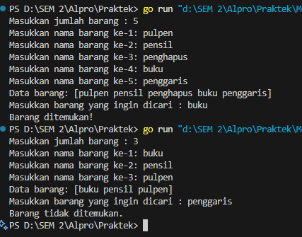
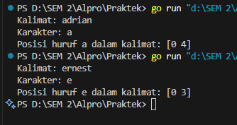
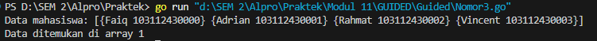
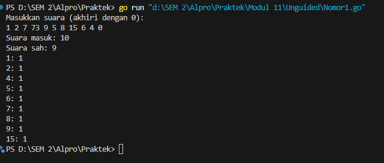
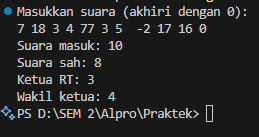
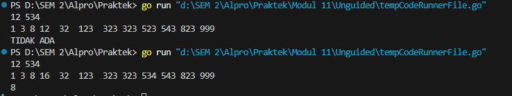

Pencarian Nilai Acak Pada Himpunan Data

Adrian Ernest Troy Rawung-103112430009

# **Dasar Teori**
___
Pencarian Nilai Acak pada Himpunan Data mencakup dua algoritma utama, yaitu Sequential Search dan Binary Search. Sequential Search atau pencarian sekuensial dilakukan dengan memeriksa setiap elemen dalam array satu per satu hingga elemen yang dicari ditemukan atau seluruh data telah diperiksa. Algoritma ini cocok digunakan pada data yang tidak terurut. Sementara itu, Binary Search adalah algoritma yang lebih efisien untuk mencari data dalam array yang sudah terurut, dengan cara membagi ruang pencarian menjadi dua bagian dan memeriksa elemen tengah untuk menentukan arah pencarian selanjutnya. Binary search hanya akan berjalan dengan benar jika data terurut sesuai dengan kriteria pencarian, baik secara ascending maupun descending. Kedua metode ini juga dapat diterapkan pada array bertipe data dasar maupun struct, dengan penyesuaian pada field yang digunakan untuk pencarian​.

____
# Guided
___
## Nomor 1

```go
package main

  

import "fmt"

  

type array []string

  

func dataBarang(n int) array {

    var barang string

    var arrayBarang array

  

    for i := 0; i < n; i++ {

        fmt.Print("Masukkan nama barang ke-", i+1, ": ")

        fmt.Scan(&barang)

        arrayBarang = append(arrayBarang, barang)

    }

    return arrayBarang

}

  

func cariArray(arrayBarang array, x string) bool {

    for i := 0; i < len(arrayBarang); i++ {

        if arrayBarang[i] == x {

            return true

        }

    }

    return false

}

  

func main() {

    var n int

    var x string

  

    fmt.Print("Masukkan jumlah barang : ")

    fmt.Scan(&n)

  

    data := dataBarang(n)

    fmt.Println("Data barang:", data)

  

    fmt.Print("Masukkan barang yang ingin dicari : ")

    fmt.Scan(&x)

  

    barang := cariArray(data, x)

  

    if barang {

        fmt.Println("Barang ditemukan!")

    } else {

        fmt.Println("Barang tidak ditemukan.")

    }

}
```

### Penjelasan:

Program ini dimulai dengan meminta pengguna untuk memasukkan jumlah item yang ingin didaftarkan. Setelah jumlah ditentukan, program akan mengumpulkan nama-nama item sesuai jumlah yang dimasukkan melalui fungsi _dataBarang_, yang menyimpan data dalam array bertipe string. Selanjutnya, pengguna diminta untuk mengetikkan nama item yang ingin dicari. Proses pencarian dilakukan menggunakan fungsi _cariArray_, yang memeriksa setiap elemen dalam array untuk mencocokkan dengan input nama item yang dicari. Jika item tersebut ditemukan, program akan memberikan notifikasi bahwa item berhasil ditemukan; sebaliknya, jika tidak ditemukan, program akan memberi tahu bahwa item tidak tersedia.

### Output:



___

## Nomor 2

```go
package main

  

import "fmt"

  

func pencarianHuruf(kalimat string, karakter string) []int {

    var posisi []int

  

    for i := 0; i < len(kalimat); i++ {

        if kalimat[i] == karakter[0] {

            posisi = append(posisi, i)

        }

    }

    return posisi

}

func main() {

  

    var kalimat, karakter string

  

    fmt.Print("Kalimat: ")

    fmt.Scan(&kalimat)

  

    fmt.Print("Karakter: ")

    fmt.Scan(&karakter)

  

    posisi := pencarianHuruf(kalimat, karakter)

  

    if len(posisi) > 0 {

        fmt.Println("Posisi huruf", karakter, "dalam kalimat:", posisi)

    } else {

        fmt.Println("Karakter", karakter, "tidak ditemukan dalam kalimat.")

    }

}
```

### Penjelasan:

Program diawali dengan meminta pengguna untuk mengetikkan sebuah kalimat beserta satu karakter yang ingin dicari. Setelah menerima masukan, program akan memanggil fungsi _pencarianHuruf_ yang bertugas memeriksa setiap karakter dalam kalimat dan mencatat indeks-indeks di mana karakter yang dicari muncul. Hasil pencarian ini kemudian dikembalikan dalam bentuk _slice_ yang berisi posisi kemunculan karakter tersebut. Jika karakter ditemukan dalam kalimat, program akan menampilkan semua posisi tersebut; namun jika tidak ditemukan, akan ditampilkan pesan bahwa karakter tidak ditemukan dalam kalimat.

### Output:


___

## Nomor 3

```go
package main

  

import "fmt"

  

type Mahasiswa struct {

    nama string

    nim  string

}

  

func binarySearch(mahasiswa []Mahasiswa, nimCari string) int {

    kiri := 0

    kanan := len(mahasiswa) - 1

  

    for kiri <= kanan {

        mid := (kiri + kanan) / 2

  

        if mahasiswa[mid].nim == nimCari {

            return mid

        } else if mahasiswa[mid].nim < nimCari {

            kiri = mid + 1

        } else {

            kanan = mid - 1

        }

    }

  

    return -1

}

  

func main() {

    var X string

  

    mahasiswa := []Mahasiswa{

        {nama: "Faiq", nim: "103112430000"},

        {nama: "Adrian", nim: "103112430001"},

        {nama: "Rahmat", nim: "103112430002"},

        {nama: "Vincent", nim: "103112430003"},

    }

    X = "103112430001"

  

    fmt.Println("Data mahasiswa:", mahasiswa)

  

    index := binarySearch(mahasiswa, X)

  

    if index != -1 {

        fmt.Printf("Data ditemukan di array %d\n", index)

    } else {

        fmt.Println("Mahasiswa dengan NIM tersebut tidak ditemukan.")

    }

}
```
### Penjelasan:

Program ini menyimpan sejumlah data mahasiswa dalam sebuah _slice_ bertipe _struct_ yang memuat nama dan NIM. Pengguna dapat mencari data mahasiswa dengan memasukkan NIM, yang kemudian diproses menggunakan algoritma _binary search_. Fungsi _binarySearch_ akan membandingkan NIM yang dicari dengan NIM pada elemen tengah dari array, lalu mempersempit pencarian ke sisi kiri atau kanan tergantung hasil perbandingan tersebut, hingga data ditemukan atau pencarian selesai. Karena menggunakan metode _binary search_, data mahasiswa harus sudah tersusun secara terurut berdasarkan NIM. Jika NIM yang dicari berhasil ditemukan, program akan menampilkan indeks lokasinya dalam array; jika tidak, akan muncul pesan bahwa data tidak tersedia.

### Output:


___

# Unguided
___
## Nomor 1

```go
package main

  

import "fmt"

  

const maxCalon = 20

  

func inputSuara() ([]int, int) {

    var suara int

    var input []int

  

    fmt.Println("Masukkan suara (akhiri dengan 0):")

    for {

        fmt.Scan(&suara)

        if suara == 0 {

            break

        }

        input = append(input, suara)

    }

  

    return input, len(input)

}

  

func hitungSuara(input []int, totalMasuk int, perolehan *[]int) int {

    var totalSah int

    for j := 0; j < totalMasuk; j++ {

        s := input[j]

        if s >= 1 && s <= maxCalon {

            (*perolehan)[s]++

            totalSah++

        }

    }

    return totalSah

}

  

func tampilkanHasil(totalMasuk int, totalSah int, perolehan []int) {

    fmt.Printf("Suara masuk: %d\n", totalMasuk)

    fmt.Printf("Suara sah: %d\n", totalSah)

  

    for k := 1; k <= maxCalon; k++ {

        if perolehan[k] > 0 {

            fmt.Printf("%d: %d\n", k, perolehan[k])

        }

    }

}

  

func main() {

    var perolehan = make([]int, maxCalon+1)

  

    input, totalMasuk := inputSuara()

    totalSah := hitungSuara(input, totalMasuk, &perolehan)

    tampilkanHasil(totalMasuk, totalSah, perolehan)

}
```
### Penjelasan:

Program ini dirancang untuk merekap hasil pemungutan suara dalam pemilihan ketua RT dengan jumlah maksimal 20 calon. Di awal, pengguna diminta untuk memasukkan suara dalam bentuk angka. Proses input suara akan terus berlangsung hingga pengguna memasukkan angka 0 sebagai penanda akhir input. Semua suara yang masuk disimpan dalam sebuah _slice_. Program kemudian menjalankan fungsi _hitungSuara_ untuk menghitung suara sah, yaitu suara dengan angka antara 1 hingga 20, serta mencatat jumlah suara yang diterima masing-masing calon dalam array _perolehan_. Setelah proses perhitungan selesai, program menampilkan total suara yang masuk, jumlah suara yang sah, dan hasil perolehan suara tiap calon yang mendapatkan dukungan, dengan memanfaatkan fungsi _tampilkanHasil_.

### Output:



___
## Nomor 2

```go
package main

  

import "fmt"

  

const maxCalon = 20

  

func inputSuara() ([]int, int) {

    var suara int

    var input []int

  

    fmt.Println("Masukkan suara (akhiri dengan 0):")

    for {

        fmt.Scan(&suara)

        if suara == 0 {

            break

        }

        input = append(input, suara)

    }

  

    return input, len(input)

}

  

func hitungSuara(input []int, totalMasuk int, perolehan []int) int {

    var totalSah int

    for j := 0; j < totalMasuk; j++ {

        s := input[j]

        if s >= 1 && s <= maxCalon {

            perolehan[s]++

            totalSah++

        }

    }

    return totalSah

}

  

func tampilkanHasil(totalMasuk int, totalSah int) {

    fmt.Printf("Suara masuk: %d\n", totalMasuk)

    fmt.Printf("Suara sah: %d\n", totalSah)

}

  

func cariKetuaWakil(perolehan []int) (int, int) {

    var ketua, wakil int

    var max1, max2 int

  

    for i := 1; i <= maxCalon; i++ {

        suara := perolehan[i]

        if suara > max1 {

            max2 = max1

            wakil = ketua

  

            max1 = suara

            ketua = i

        } else if suara == max1 && i < ketua {

            max2 = max1

            wakil = ketua

  

            ketua = i

        } else if suara > max2 {

            max2 = suara

            wakil = i

        } else if suara == max2 && i < wakil && i != ketua {

            wakil = i

        }

    }

    return ketua, wakil

}

  

func main() {

    perolehan := make([]int, maxCalon+1)

  

    input, totalMasuk := inputSuara()

    totalSah := hitungSuara(input, totalMasuk, perolehan)

  

    tampilkanHasil(totalMasuk, totalSah)

  

    ketua, wakil := cariKetuaWakil(perolehan)

    if totalSah > 0 {

        fmt.Printf("Ketua RT: %d\n", ketua)

        if wakil > 0 {

            fmt.Printf("Wakil ketua: %d\n", wakil)

        }

    }

}
```
### Penjelasan:

Program ini merupakan kelanjutan dari soal nomor 1 dan berfungsi untuk merekap sekaligus menentukan hasil pemilihan ketua dan wakil ketua RT dari maksimal 20 calon. Proses dimulai dengan pengguna memasukkan suara satu per satu, dan dihentikan dengan memasukkan angka 0 sebagai tanda akhir input. Semua suara yang diterima dihitung jumlah totalnya dan diproses melalui fungsi _hitungSuara_, yang memisahkan suara sah—yakni angka antara 1 hingga 20—dan mencatat perolehan suara masing-masing calon ke dalam array _perolehan_. Fungsi _tampilkanHasil_ digunakan untuk menampilkan total suara yang masuk serta jumlah suara sah. Selanjutnya, program menggunakan fungsi _cariKetuaWakil_ untuk menentukan calon yang terpilih sebagai ketua dan wakil ketua RT berdasarkan dua perolehan suara tertinggi. Jika terdapat jumlah suara yang sama, maka calon dengan nomor lebih kecil akan diprioritaskan. Apabila terdapat suara sah, program akan menampilkan nomor calon yang terpilih sebagai ketua dan wakil.

### Output:


___
## Nomor 3

```go
package main

  

import "fmt"

  

const NMAX = 1000000

  

var data [NMAX]int

  

func isiArray(n int) {

    for i := 0; i < n; i++ {

        fmt.Scan(&data[i])

    }

}

  

func posisi(n, k int) int {

    low := 0

    high := n - 1

  

    for low <= high {

        mid := (low + high) / 2

        if data[mid] == k {

            return mid

        } else if data[mid] < k {

            low = mid + 1

        } else {

            high = mid - 1

        }

    }

  

    return -1

}

  

func main() {

    var n, k int

    fmt.Scan(&n, &k)

  

    isiArray(n)

  

    idx := posisi(n, k)

    if idx == -1 {

        fmt.Println("TIDAK ADA")

    } else {

        fmt.Println(idx)

    }

}
```

### Penjelasan:

Program ini dirancang untuk memeriksa apakah suatu angka tertentu terdapat dalam sekumpulan angka yang dimasukkan oleh pengguna. Langkah pertama, pengguna diminta memasukkan sejumlah data angka, kemudian diikuti dengan input angka yang ingin dicari. Seluruh angka yang telah dimasukkan disimpan dan diproses menggunakan algoritma _binary search_, yaitu metode pencarian efisien yang bekerja dengan membandingkan nilai di posisi tengah dari data yang sudah diurutkan. Jika angka yang dicari ditemukan dalam kumpulan tersebut, program akan menampilkan posisi atau indeks kemunculannya. Sebaliknya, jika angka tersebut tidak ada, maka akan ditampilkan pesan bahwa angka tidak ditemukan dalam data.

### Output:

