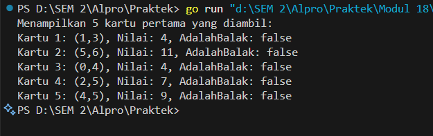
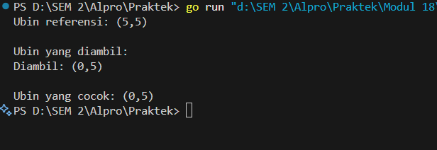

<h1 align="center">Laporan Praktikum Modul 18<br>Mesin Abstrak</h1>
<p align="center">ADRIAN ERNEST TROY RAWUNG- 103112430009</p>

# Dasar Teori
Mesin abstrak adalah model komputasi yang dibangun di atas mesin komputasi yang sudah ada, dengan menggunakan tipe data dan operasi dasar dari mesin sebelumnya untuk membentuk operasi baru. Konsep ini digunakan dalam pengembangan perangkat lunak. Contoh penerapannya dapat dilihat pada mesin domino, yang memiliki tipe data berupa kartu domino dengan dua sisi bernilai 0 hingga 6 pip, dan operasi dasar seperti mengocok, mengambil, melihat, dan menilai kartu. Setiap kartu bernilai total pip dari kedua sisinya (0–12), tanpa duplikasi (misalnya, kartu 1-4 sama dengan 4-1). Kasus penggunaan mesin domino mencakup pencarian kartu dengan gambar yang sama, pengecekan kartu balak (kedua sisi sama), dan penjumlahan dua kartu menjadi 12. Beberapa permainan yang menggunakan prinsip ini antara lain Gapleh, Kiu-kiu, Luzon, dan Texas 42.

---
# Unguided
## Soal 1
>Implementasi operasi dasar mesin domino sebagai sebuah subprogram: 
>a) Buat tipe data kartu domino (Domino) yang menyimpan informasi 
>➢ gambar (suit) kedua sisi kartu 
>➢ nilai kartu 
>➢ Boolean data yang menyatakan kartu ini balak atau bukan 
>➢ Buat tipe data satu set kartu domino (Dominoes) 
>➢ Array menyimpan 28 kartu Domino 
>➢ Jumlah kartu tersisa dalam array tersebut 
>b) prosedur kocokKartu(Dominoes) 
>c) fungsi ambilKartu(Dominoes) → Domino 
>d) fungsi gambarKartu(Domino,suit int) → int 
>e) fungsi nilaiKartu(Domino) → int

```go
package main

import (
	"fmt"
	"math/rand"
	"time"
)

type Domino struct {
	sisiSatu    int
	sisiDua     int
	nilai       int
	adalahBalak bool
}

type SetDomino struct {
	kartu  [28]Domino
	jumlah int
}

func inisialisasiSetDomino(set *SetDomino) {
	idx := 0
	for a := 0; a <= 6; a++ {
		for b := a; b <= 6; b++ {
			kartu := Domino{
				sisiSatu:    a,
				sisiDua:     b,
				nilai:       a + b,
				adalahBalak: a == b,
			}
			set.kartu[idx] = kartu
			idx++
		}
	}
	set.jumlah = 28
}

func acakKartu(set *SetDomino) {
	rand.Seed(time.Now().UnixNano())
	for i := set.jumlah - 1; i > 0; i-- {
		indeksAcak := rand.Intn(i + 1)
		set.kartu[i], set.kartu[indeksAcak] = set.kartu[indeksAcak], set.kartu[i]
	}
}

func ambilKartu(set *SetDomino) Domino {
	if set.jumlah == 0 {
		return Domino{-1, -1, -1, false}
	}
	set.jumlah--
	return set.kartu[set.jumlah]
}

func dapatkanSisiKartu(kartu Domino, sisi int) int {
	if sisi == 1 {
		return kartu.sisiSatu
	} else if sisi == 2 {
		return kartu.sisiDua
	}
	return -1
}

func dapatkanNilaiKartu(kartu Domino) int {
	return kartu.nilai
}

func main() {
	var setDomino SetDomino

	inisialisasiSetDomino(&setDomino)
	acakKartu(&setDomino)

	fmt.Println("Menampilkan 5 kartu pertama yang diambil:")
	for i := 0; i < 5; i++ {
		kartu := ambilKartu(&setDomino)
		fmt.Printf("Kartu %d: (%d,%d), Nilai: %d, AdalahBalak: %v\n",
			i+1, kartu.sisiSatu, kartu.sisiDua, dapatkanNilaiKartu(kartu), kartu.adalahBalak)
	}
}

```

### Penjelasan
Program Go ini mendemonstrasikan operasi dasar untuk mengelola satu set kartu domino. Program dimulai dengan mendefinisikan struktur data untuk satu kartu Domino (menyimpan nilai sisiSatu, sisiDua, nilai total, dan status balak) dan satu set Dominoes (berisi array 28 kartu dan jumlah kartu tersisa). Fungsi inisialisasiDomino menciptakan 28 kartu domino unik, kemudian kocokKartu mengacaknya secara acak menggunakan seed berbasis waktu. Fungsi ambilKartu digunakan untuk mengambil satu kartu dari tumpukan, gambarKartu untuk mendapatkan nilai dari sisi tertentu sebuah kartu, dan nilaiKartu untuk mendapatkan nilai total kartu tersebut. Sebagai contoh penggunaan, fungsi main menginisialisasi, mengocok, lalu mengambil dan menampilkan detail lima kartu pertama dari tumpukan, menunjukkan bagaimana fungsi-fungsi dasar ini bekerja bersama.

---
## Soal 2
>Realisasi aksi berikut menggunakan operasi-operasi dasar mesin domino: 
>a) prosedur galiKartu(Dominoes,Domino) yang mengambil kartu dari tumpukan sampai diperoleh kartu dengan gambar (suit) yang sama dengan kartu yang diberikan
>b) fungsi sepasangKartu(Domino,Domino) → boolean; yang memberikan nilai true jika total nilai kartu adalah 12 dan false jika tidak.

```go
package main

import (
	"fmt"
	"math/rand"
	"time"
)

type Ubin struct {
	sisiSatu    int
	sisiDua     int
	nilai       int
	apakahGanda bool
}

type SetUbin struct {
	ubin   [28]Ubin
	jumlah int
}

func inisialisasiUbin(su *SetUbin) {
	idx := 0
	for a := 0; a <= 6; a++ {
		for b := a; b <= 6; b++ {
			u := Ubin{
				sisiSatu:    a,
				sisiDua:     b,
				nilai:       a + b,
				apakahGanda: a == b,
			}
			su.ubin[idx] = u
			idx++
		}
	}
	su.jumlah = 28
}

func acakUbin(su *SetUbin) {
	rand.Seed(time.Now().UnixNano())
	for i := su.jumlah - 1; i > 0; i-- {
		j := rand.Intn(i + 1)
		su.ubin[i], su.ubin[j] = su.ubin[j], su.ubin[i]
	}
}

func ambilUbin(su *SetUbin) Ubin {
	if su.jumlah == 0 {
		return Ubin{-1, -1, -1, false}
	}
	su.jumlah--
	return su.ubin[su.jumlah]
}

func dapatkanSisiUbin(u Ubin, sisi int) int {
	if sisi == 1 {
		return u.sisiSatu
	} else if sisi == 2 {
		return u.sisiDua
	} else {
		return -1
	}
}

func dapatkanNilaiUbin(u Ubin) int {
	return u.nilai
}

func cocok(u1, u2 Ubin) bool {
	return u1.sisiSatu == u2.sisiSatu ||
		u1.sisiSatu == u2.sisiDua ||
		u1.sisiDua == u2.sisiSatu ||
		u1.sisiDua == u2.sisiDua
}

func cariUbinCocok(su *SetUbin, referensi Ubin) Ubin {
	fmt.Println("\nUbin yang diambil: ")
	for su.jumlah > 0 {
		ubin := ambilUbin(su)
		fmt.Printf("Diambil: (%d,%d)\n", ubin.sisiSatu, ubin.sisiDua)
		if cocok(ubin, referensi) {
			return ubin
		}
	}
	return Ubin{-1, -1, -1, false}
}

func main() {
	var setUbin SetUbin

	inisialisasiUbin(&setUbin)
	acakUbin(&setUbin)

	ubinReferensi := ambilUbin(&setUbin)
	fmt.Printf("Ubin referensi: (%d,%d)\n", ubinReferensi.sisiSatu, ubinReferensi.sisiDua)

	ubinCocok := cariUbinCocok(&setUbin, ubinReferensi)

	if ubinCocok.sisiSatu == -1 {
		fmt.Println("Tidak ada ubin yang cocok.")
	} else {
		fmt.Printf("\nUbin yang cocok: (%d,%d)\n", ubinCocok.sisiSatu, ubinCocok.sisiDua)
	}
}

```

### Penjelasan
Program Go ini merupakan pengembangan dari sistem dasar pengelolaan kartu domino, yang kini menyertakan logika pencocokan kartu. Selain mempertahankan struktur data Domino dan Dominoes beserta fungsi-fungsi dasar seperti inisialisasi, pengocokan (kocokKartu dengan seed waktu), dan pengambilan kartu (ambilKartu), program ini memperkenalkan fungsi cocok untuk memeriksa apakah dua kartu domino memiliki setidaknya satu sisi dengan nilai yang sama. Fungsi baru lainnya, galiKartu, secara berulang mengambil kartu dari tumpukan, menampilkan setiap kartu yang diambil, dan mengembalikan kartu pertama yang ditemukan cocok dengan sebuah kartuReferensi yang telah ditentukan. Fungsi main mendemonstrasikan alur ini dengan mengambil satu kartu sebagai referensi, kemudian memanggil galiKartu untuk mencari dan menampilkan kartu yang cocok dari sisa tumpukan, atau menyatakan tidak ada yang cocok jika seluruh kartu dalam tumpukan habis tanpa ditemukan pasangan.

---
## Soal 3
>Implementasi salah satu permainan domino. Lihat lampiran untuk deskripsi permainan Gapleh.

```go
package main

  

import (

    "fmt"

    "math/rand"

    "time"

)

  

type Domino struct {

    kiri  int

    kanan int

}

  

func buatSetDomino() []Domino {

    var setDomino []Domino

    for i := 0; i <= 6; i++ {

        for j := i; j <= 6; j++ {

            setDomino = append(setDomino, Domino{i, j})

        }

    }

    return setDomino

}

  

func kocokDomino(kartu []Domino) {

    rand.Seed(time.Now().UnixNano())

    rand.Shuffle(len(kartu), func(i, j int) {

        kartu[i], kartu[j] = kartu[j], kartu[i]

    })

}

  

func cocok(kartu Domino, ujung int) bool {

    return kartu.kiri == ujung || kartu.kanan == ujung

}

  

func balikKartu(kartu Domino) Domino {

    return Domino{kartu.kanan, kartu.kiri}

}

  

func tampilkanKartu(kartu Domino) string {

    return fmt.Sprintf("[%d|%d]", kartu.kiri, kartu.kanan)

}

  

func main() {

    setDomino := buatSetDomino()

    ronde := 0

    totalSkor := 0

  

    for {

        ronde++

        fmt.Printf("\n--- Ronde %d ---\n", ronde)

        kocokDomino(setDomino)

  

        tumpukan := append([]Domino(nil), setDomino...)

        kartuPemain := tumpukan[:7]

        tumpukan = tumpukan[7:]

  

        rantai := []Domino{tumpukan[0]}

        tumpukan = tumpukan[1:]

        skor := 0

  

        for {

            fmt.Println("\nRantai:")

            for _, kartu := range rantai {

                fmt.Print(tampilkanKartu(kartu), " ")

            }

            fmt.Println("\n\nKartu Anda:")

            for idx, kartu := range kartuPemain {

                fmt.Printf("%2d: %s\n", idx+1, tampilkanKartu(kartu))

            }

            fmt.Println("101010: Akhiri Ronde | 909090: Akhiri Permainan")

            fmt.Print("Pilihan Anda (-7..-1 kiri, 1..7 kanan): ")

  

            var pilihan int

            fmt.Scan(&pilihan)

  

            if pilihan == 101010 {

                fmt.Println("Ronde dihentikan.")

                break

            } else if pilihan == 909090 {

                fmt.Println("Permainan selesai.")

                fmt.Printf("Total Ronde: %d, Total Skor: %d\n", ronde-1, totalSkor)

                return

            }

  

            if pilihan < -len(kartuPemain) || pilihan > len(kartuPemain) || pilihan == 0 {

                fmt.Println("Pilihan tidak valid.")

                continue

            }

  

            absPilihan := pilihan

            if absPilihan < 0 {

                absPilihan = -absPilihan

            }

            if absPilihan > len(kartuPemain) {

                fmt.Println("Indeks kartu tidak tersedia.")

                continue

            }

  

            kartuTerpilih := kartuPemain[absPilihan-1]

            bisaMain := false

  

            if pilihan < 0 {

                ujungKiri := rantai[0].kiri

                if cocok(kartuTerpilih, ujungKiri) {

                    if kartuTerpilih.kanan == ujungKiri {

                        rantai = append([]Domino{kartuTerpilih}, rantai...)

                    } else {

                        rantai = append([]Domino{balikKartu(kartuTerpilih)}, rantai...)

                    }

                    bisaMain = true

                }

            } else {

                ujungKanan := rantai[len(rantai)-1].kanan

                if cocok(kartuTerpilih, ujungKanan) {

                    if kartuTerpilih.kiri == ujungKanan {

                        rantai = append(rantai, kartuTerpilih)

                    } else {

                        rantai = append(rantai, balikKartu(kartuTerpilih))

                    }

                    bisaMain = true

                }

            }

  

            if bisaMain {

                kartuPemain = append(kartuPemain[:absPilihan-1], kartuPemain[absPilihan:]...)

                skor++

            } else {

                if len(tumpukan) > 0 {

                    fmt.Println("Kartu tidak cocok. Mengambil kartu dari tumpukan...")

                    kartuPemain = append(kartuPemain, tumpukan[0])

                    tumpukan = tumpukan[1:]

                } else {

                    fmt.Println("Kartu tidak cocok dan tumpukan sudah habis.")

                }

            }

  

            if len(kartuPemain) == 0 {

                fmt.Println("Semua kartu habis. Ronde selesai!")

                break

            }

  

            bisaMainLagi := false

            ujungKiri := rantai[0].kiri

            ujungKanan := rantai[len(rantai)-1].kanan

            for _, kartu := range kartuPemain {

                if cocok(kartu, ujungKiri) || cocok(kartu, ujungKanan) {

                    bisaMainLagi = true

                    break

                }

            }

            if !bisaMainLagi && len(tumpukan) == 0 {

                fmt.Println("Tidak ada kartu yang bisa dimainkan dan tumpukan habis. Ronde selesai!")

                break

            }

        }

  

        fmt.Printf("Skor Ronde %d: %d\n", ronde, skor)

        totalSkor += skor

    }

}
```

### Penjelasan
Program Go ini mensimulasikan permainan kartu domino solitaire yang interaktif. Setiap ronde, 28 kartu domino standar dibuat melalui buatSetKartuDomino dan dikocok secara acak menggunakan kocokKartu dengan seed berbasis waktu, kemudian tujuh kartu dibagikan kepada pemain sementara sisanya menjadi tumpukan. Satu kartu dari tumpukan diletakkan sebagai awal rantai di meja, dan pemain diminta memilih kartu dari tangannya untuk dipasangkan pada ujung kiri (input negatif) atau kanan (input positif) rantai tersebut. Program akan memeriksa kecocokan sisi kartu menggunakan fungsi cocok dan jika perlu, secara konseptual membalik kartu (balikKartu) agar sisi yang sesuai dapat terhubung ke rantai. Jika kartu berhasil dimainkan, skor pemain untuk ronde tersebut bertambah dan kartu dikeluarkan dari tangan, apabila kartu pilihan tidak cocok, pemain akan mengambil satu kartu dari tumpukan jika masih tersedia. Ronde permainan berakhir jika pemain memilih untuk selesai (input 101010), berhasil menghabiskan semua kartunya, atau tidak ada lagi langkah yang mungkin dilakukan sementara tumpukan juga telah habis, di mana skor ronde akan dicatat dan permainan dapat dilanjutkan ke ronde berikutnya atau diakhiri sepenuhnya jika pemain menginput 909090.

---
## Soal 4
>Implementasi mesin abstrak karakter yang bekerja terhadap untaian karakter (yang diakhiri dengan penanda titik (".") dan mempunyai sejumlah operasi dasar. 
>a) Operasi dasar mesin karakter: 
>➢ Prosedur start(); yang menyiapkan mesin karakter di awal rangkaian karakter. 
>➢ Prosedur maju(); yang memajukan pembaca ke posisi karakter berikutnya. 
>➢ Fungsi eop(); yang mengembalikan nilai true apabila sudah mencapai akhir rangkaian, sampai ke penanda titik ("."). 
>➢ Fungsi cc(); yang mengembalikan karakter yang sedang terbaca, atau berada pada posisi pembacaan mesin. 
>b) Dengan operasi dasar di atas buat algoritma untuk: 
>➢ Membaca seluruh karakter yang diberikan ke mesin karakter tersebut. 
>➢ Menghitung berapa banyak karakter yang terbaca. 
>➢ Menghitung ada berapa huruf "A" yang terbaca. 
>➢ Menghitung frekuensi kemunculan huruf "A" terhadap seluruh karakter terbaca. 
>➢ Menghitung ada berapa kata "LE" (pasangan berturutan huruf "L" dan "E") yang terbaca.

```go
package main

  

import (

    "fmt"

    "strings"

)

  

var kalimat string

var posisi int

var karakterSekarang byte

  

func mulai() {

    posisi = 0

    karakterSekarang = kalimat[posisi]

}

  

func maju() {

    posisi++

    if posisi < len(kalimat) {

        karakterSekarang = kalimat[posisi]

    }

}

  

func karakterSaatIni() byte {

    return karakterSekarang

}

  

func akhirKalimat() bool {

    return karakterSekarang == '.'

}

  

func main() {

    fmt.Print("Masukkan kalimat yang diakhiri dengan tanda titik ('.'): ")

    fmt.Scanln(&kalimat)

  

    if !strings.HasSuffix(kalimat, ".") {

        fmt.Println("Kalimat harus diakhiri dengan tanda titik ('.')")

        return

    }

  

    mulai()

  

    totalKarakter := 0

    totalA := 0

    totalLE := 0

    var karakterSebelumnya byte = 0

  

    for !akhirKalimat() {

        karakter := karakterSaatIni()

        totalKarakter++

  

        if strings.ToUpper(string(karakter)) == "A" {

            totalA++

        }

  

        if strings.ToUpper(string(karakterSebelumnya)) == "L" && strings.ToUpper(string(karakter)) == "E" {

            totalLE++

        }

  

        karakterSebelumnya = karakter

        maju()

    }

  

    frekuensiA := float64(totalA) / float64(totalKarakter) * 100

  

    fmt.Println("Total karakter    :", totalKarakter)

    fmt.Println("Total huruf 'A'   :", totalA)

    fmt.Printf("Frekuensi 'A'     : %.2f%%\n", frekuensiA)

    fmt.Println("Total kata 'LE'   :", totalLE)

}
```

### Penjelasan
Program Go ini berfungsi sebagai mesin analisis karakter yang memproses untaian teks masukan dari pengguna, yang diwajibkan diakhiri dengan tanda titik (".") sebagai penanda akhir. Program menggunakan serangkaian fungsi dasar seperti start untuk menginisialisasi pembacaan di awal untaian, maju untuk memindahkan posisi ke karakter berikutnya, cc untuk mendapatkan karakter saat ini, dan eop untuk mendeteksi jika sudah mencapai tanda titik. Setelah input divalidasi, program akan mengiterasi melalui setiap karakter sebelum titik, menghitung jumlah total karakter yang dibaca, jumlah kemunculan huruf 'A' (secara case-insensitive menggunakan strings.ToUpper), dan jumlah kemunculan pasangan huruf "LE" (juga secara case-insensitive). Akhirnya, program akan menampilkan hasil perhitungan tersebut, termasuk frekuensi kemunculan huruf 'A' dalam bentuk persentase terhadap total karakter yang dibaca.
