Laporan Praktikum Modul 2
REVIEW PENGENALAN PEMROGRAMAN

Dasar Teori
Bahasa ini dirancang untuk sederhana, cepat, dan efisien, terutama dalam pengembangan sistem backend dan pemrograman konkuren. Go memiliki tipe data statis, garbage collection, serta mendukung goroutines untuk pemrosesan paralel yang ringan. Sintaksnya sederhana dan ringkas, sehingga mudah dipelajari. Selain itu, Go memiliki waktu kompilasi yang cepat, menjadikannya pilihan populer untuk pengembangan aplikasi skala besar. Tidak seperti bahasa pemrograman lain yang mendukung class dan inheritance, Go menggunakan konsep struct dan interface untuk membangun sistem berbasis objek secara lebih fleksibel. Selain itu, Go tidak memiliki exception handling seperti try-catch, melainkan menggunakan mekanisme error handling berbasis nilai yang harus ditangani secara eksplisit.

Unguided

Nama : Adrian Ernest Troy Rawung
NIM : 103112430009
Kelas: IF-05
**Modul 2 A**
Nomor 1
```go
package main

import "fmt"

func main() {

    var (

        satu, dua, tiga string

        temp            string

    )

    fmt.Print("Masukkan input string: ")

    fmt.Scanln(&satu)

    fmt.Print("Masukkan input string: ")

    fmt.Scanln(&dua)

    fmt.Print("Masukkan input string: ")

    fmt.Scanln(&tiga)

  

    fmt.Println("Output awal =", satu, dua, tiga)

  

    temp = satu

    satu = dua

    dua = tiga

    tiga = temp

  

    fmt.Println("Output akhir =", satu, dua, tiga)

}
```

Penjelasan :
Program ini membaca tiga input dari pengguna, menampilkannya, lalu menukar urutannya sebelum mencetak hasil akhirnya. Awalnya, program meminta pengguna memasukkan tiga string satu per satu. Setelah semua input diterima, program menampilkan urutan awal dari ketiga string tersebut. Kemudian, program menukar posisi string dengan cara menggesernya ke kiri—string pertama pindah ke posisi terakhir, sementara string kedua dan ketiga masing-masing bergeser ke depan. Setelah pertukaran selesai, program mencetak urutan baru. Misalnya, jika pengguna memasukkan "A", "B", dan "C", maka urutan awalnya adalah "A B C", dan setelah ditukar menjadi "B C A".

Output:
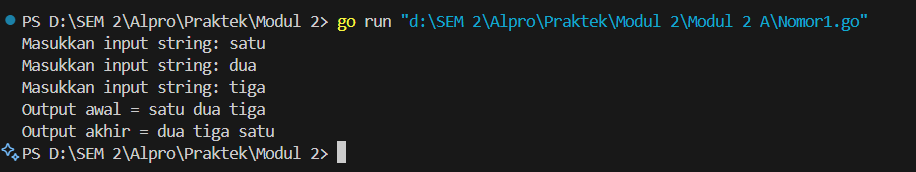

Nomor 2
```go
package main

  

import "fmt"

  

func main() {

    var year int

    fmt.Print("Masukkan tahun: ")

    fmt.Scan(&year)

  

    if (year%400 == 0) || (year%4 == 0 && year%100 != 0) {

        fmt.Println("true")

    } else {

        fmt.Println("false")

    }

}
```
Penjelasan :
Program ini dibuat untuk menentukan apakah suatu tahun adalah tahun kabisat atau bukan. Pertama, program meminta pengguna memasukkan tahun, lalu menyimpannya dalam variabel `year`. Setelah itu, program memeriksa apakah tahun tersebut memenuhi aturan tahun kabisat. Aturannya sederhana: jika tahun bisa dibagi habis oleh 400, maka pasti kabisat. Jika tidak, tapi bisa dibagi habis oleh 4 **dan** tidak bisa dibagi habis oleh 100, maka juga kabisat. Kalau tidak memenuhi kedua kondisi itu, berarti bukan tahun kabisat. Hasilnya akan ditampilkan sebagai **"true"** jika kabisat, dan **"false"** jika tidak.

output:
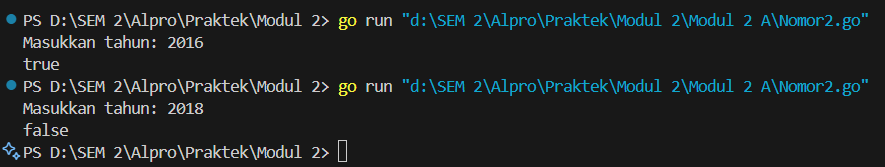

Nomor 3
```go
func main() {

    var r float64

    const pi = 3.1415926535

  

    fmt.Print("Masukkan jari-jari bola: ")

    fmt.Scan(&r)

  

    r2 := r * r      

    r3 := r2 * r      

  

    volume := (4.0 / 3.0) * pi * r3

    luas := 4 * pi * r2

  

    fmt.Printf("Volume bola: %.2f\n", volume)

    fmt.Printf("Luas permukaan bola: %.2f\n", luas)
```
Penjelasan:
Program ini meminta pengguna memasukkan jari-jari bola, lalu menghitung volume dan luas permukaan bola. Program menghitung volume bola dengan rumus (4/3)πr^3 dan luas permukaan bola dengan rumus 4πr^2. Hasil perhitungan ditampilkan dengan dua angka di belakang koma. Misalnya, jika pengguna memasukkan jari-jari 5.

Output:
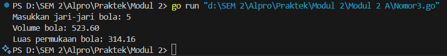

Nomor 4
```go
package main

  

import "fmt"

  

func main() {

    var celsius float64

  

    fmt.Print("Masukkan suhu dalam Celsius: ")

    fmt.Scan(&celsius)

  

    fahrenheit := (celsius * 9 / 5) + 32

    reamur := celsius * 4 / 5

    kelvin := celsius + 273.15

  

    fmt.Printf("Fahrenheit: %.2f°F\n", fahrenheit)

    fmt.Printf("Reamur: %.2f°R\n", reamur)

    fmt.Printf("Kelvin: %.2fK\n", kelvin)
```
Penjelasan:
Program ini meminta pengguna memasukkan suhu dalam derajat Celsius, lalu mengonversinya ke Fahrenheit, Reamur, dan Kelvin. Program menghitung suhu Fahrenheit dengan rumus (Celsius × 9/5) + 32, suhu Reamur dengan rumus Celsius × 4/5, dan suhu Kelvin dengan rumus Celsius + 273.15. Hasil konversi ditampilkan dengan dua angka di belakang koma. Misalnya, jika pengguna memasukkan suhu 100 derajat Celsius

Output:
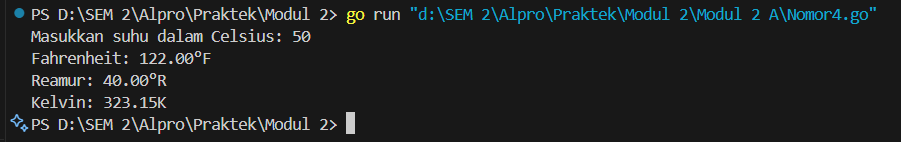

Nomor 5
```go
package main

  

import "fmt"

  

func main() {

    var a, b, c, d, e int

    var x, y, z byte

  

    fmt.Scan(&a, &b, &c, &d, &e)

    fmt.Scanln()

  

    fmt.Scanf("%c%c%c" , &x, &y, &z)

  

    fmt.Printf("%c%c%c%c%c\n", a, b, c, d, e)

  

    fmt.Printf("%c%c%c\n", x+1, y+1, z+1)

}
```
Penjelasan:
Program ini membaca lima angka dan tiga karakter dari input pengguna, lalu mengubahnya menjadi karakter ASCII untuk ditampilkan. Pertama, lima angka yang dimasukkan oleh pengguna disimpan dalam variabel `a, b, c, d, e`, sedangkan tiga karakter disimpan dalam variabel `x, y, z`. Setelah itu, program mencetak lima angka pertama dalam bentuk karakter ASCII yang sesuai dengan nilainya. Selanjutnya, program mengambil tiga karakter yang dimasukkan, menambahkan nilai **1** ke setiap karakter, lalu mencetak hasilnya. Misalnya, jika pengguna memasukkan angka **72 101 108 108 111**, maka akan dicetak sebagai **"Hello"**, karena angka-angka tersebut mewakili huruf-huruf dalam kode ASCII. Jika pengguna memasukkan karakter **x, y, z**, maka program akan mencetak **y, z, {** karena setiap karakter bertambah satu nilai dalam kode ASCII. Program ini menunjukkan bagaimana angka dapat dikonversi menjadi teks dan bagaimana karakter bisa dimanipulasi dalam bahasa Go.

Output:
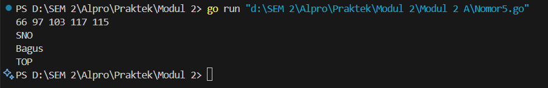

**Modul 2 B**

Nomor 1
```go
package main

  

import "fmt"

  

func main() {

    referensi := []string{"merah", "kuning", "hijau", "ungu"}

    berhasil := true

  

    for i := 0; i < 5; i++ {

        for j := 0; j < 4; j++ {

            var warna string

            fmt.Scan(&warna)

            if warna != referensi[j] {

                berhasil = false

            }

        }

    }
```
Penjelasan:
Program ini meminta pengguna memasukkan warna merah, kuning, hijau, dan ungu sebanyak lima kali. Program akan menampilkan "BERHASIL: true" jika pengguna berhasil memasukkan warna yang diminta, dan "BERHASIL: false" jika pengguna salah memasukkan warna. Misalnya, jika pengguna memasukkan warna merah, kuning, hijau, dan ungu sebanyak lima kali, maka program akan menampilkan "BERHASIL: true". Jika pengguna salah memasukkan warna, maka program akan menampilkan "BERHASIL: false".

Output:
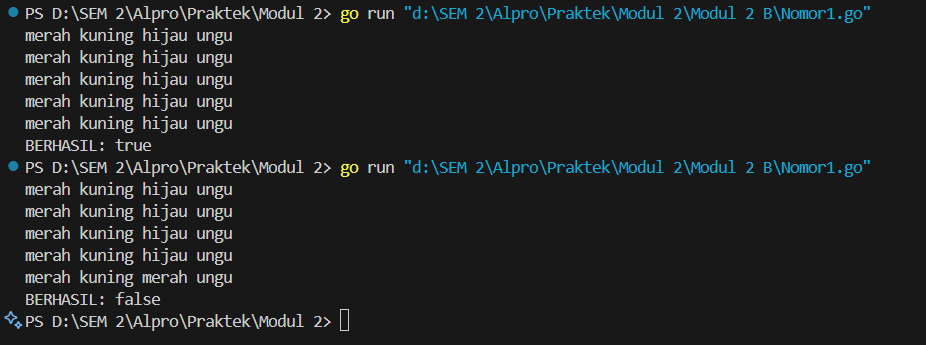

Nomor 2
```go
package main

  

import "fmt"

  

func main() {

    var bunga, pita string

    var count int

  

    for {

        fmt.Printf("Bunga %d: ", count+1)

        fmt.Scan(&bunga)

  

        if bunga == "SELESAI" {

            break

        }

  

        if pita == "" {

            pita = bunga

        } else {

            pita += " - " + bunga

        }

  

        count++

    }

  

    fmt.Println("Pita:", pita+" -")

    fmt.Println("Bunga:",count)

}
```
Penjelasan:
Program ini dibuat untuk mencatat nama bunga yang dimasukkan oleh pengguna dan menghitung jumlahnya. Setiap kali pengguna memasukkan nama bunga, program akan menambahkannya ke dalam daftar yang dipisahkan dengan tanda `" - "`. Proses ini terus berulang hingga pengguna mengetik **"SELESAI"**, yang akan menghentikan input. Setelah itu, program menampilkan daftar bunga yang telah dimasukkan dan jumlahnya. Untuk memastikan hasilnya rapi, program menghapus tanda pemisah terakhir menggunakan `strings.TrimSuffix()`, sehingga tidak ada `" - "` yang tersisa di akhir daftar. Misalnya, jika pengguna memasukkan **"Mawar, Melati, Tulip"**, program akan mencetak **"Mawar - Melati - Tulip"** beserta jumlah bunganya. Program ini cukup sederhana, tetapi sangat berguna untuk mencatat daftar item dengan format yang bersih dan mudah dibaca.

Output:
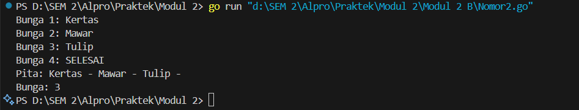

Nomor 3
```go
package main

  

import "fmt"

  

func main() {

    var berat1, berat2 float64

    totalBerat := 0.0

  

    for {

        fmt.Print("Masukan berat belanjaan di kedua kantong: ")

        fmt.Scan(&berat1, &berat2)

  

        if berat1 < 0 || berat2 < 0 || (totalBerat+berat1+berat2) > 150 {

            break

        }

  

        selisih := berat1 - berat2

        if selisih < 0 {

            selisih = -selisih

        }

  

        fmt.Println("Sepeda motor pak Andi akan oleng:", selisih >= 9)

  

        totalBerat += berat1 + berat2

    }

  

    fmt.Println("Proses selesai.")

}
```
Penjelasan:
Program ini dirancang untuk membantu Pak Andi mengecek apakah sepeda motornya akan oleng saat membawa belanjaan di dua kantong. Setiap kali pengguna memasukkan berat belanjaan di kedua kantong, program akan menghitung selisih beratnya. Jika selisih antara kedua kantong **9 kg atau lebih**, program akan memberi tahu bahwa sepeda motor Pak Andi bisa oleng. Program terus meminta input hingga terjadi salah satu dari tiga kondisi berikut: pengguna memasukkan berat negatif, total berat belanjaan melebihi **150 kg**, atau pengguna menghentikan input. Jika salah satu dari kondisi tersebut terpenuhi, program akan berhenti dan menampilkan pesan bahwa proses telah selesai. Dengan cara ini, program memastikan bahwa beban di motor tetap seimbang dan tidak melebihi batas yang aman.

Output:
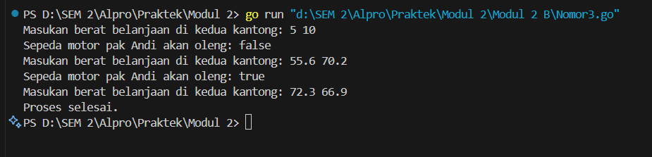


Nomor 4 A
```go
package main

  

import "fmt"

  

func main() {

    var K float64

    fmt.Print("Nilai K = ")

    fmt.Scan(&K)

  

    fk := ((4*K + 2) * (4*K + 2)) / ((4*K + 1) * (4*K + 3))

  

    fmt.Printf("Nilai f(K) = %.10f\n", fk)

}
```
Penjelasan:
Program ini menghitung nilai dari sebuah fungsi matematika berdasarkan rumus tertentu. Pengguna diminta memasukkan angka `K`, lalu program menghitung hasilnya menggunakan rumus yang sudah ditentukan. Hasil perhitungan disimpan dalam variabel `fk` dan ditampilkan dengan 10 angka di belakang koma. Misalnya, jika pengguna memasukkan `K = 3`, program akan menghitung hasilnya dan menampilkan angka sekitar `1.0051282051`. Program ini hanya berfungsi untuk menghitung dan menampilkan hasil sesuai rumus.

Output:
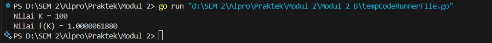


Nomor 4 B
```go
package main

import "fmt"

func main() {
	var K int
	fmt.Print("Masukkan nilai K: ")
	fmt.Scan(&K)

	// Menghitung hampiran akar 2
	akar2 := 1.0
	for i := 0; i <= K; i++ {
		pembilang := (4*i + 2) * (4*i + 2)
		penyebut := (4*i + 1) * (4*i + 3)
		akar2 *= float64(pembilang) / float64(penyebut)
	}

	// Menampilkan hasil dengan 10 angka di belakang koma
	fmt.Printf("Nilai akar 2 = %.10f\n", akar2)
}
```
Penjelasan:
Program ini menghitung nilai hampiran akar 2 menggunakan metode perkalian pecahan. Pengguna diminta memasukkan nilai *K, yang menentukan berapa kali perhitungan dilakukan. Program memulai dengan nilai awal **1.0, lalu dalam perulangan sebanyak **K* kali, program menghitung pembilang dan penyebut berdasarkan rumus tertentu dan mengalikannya untuk mendekati akar 2. Hasil akhirnya ditampilkan dengan 10 angka di belakang koma.

Output:
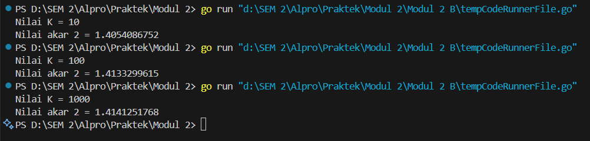

**Modul 2 C **

Nomor 1
```go
package main

  

import "fmt"

  

func main() {

    var berat int

    fmt.Print("Berat parsel (gram): ")

    fmt.Scan(&berat)

  

    kg := berat / 1000

    gram := berat % 1000

  

    biayaKg := kg * 10000

    biayaGram := 0

  

    if gram > 0 {

        if gram >= 500 {

            biayaGram = gram * 5

        } else {

            biayaGram = gram * 15

        }

    }

  

    if kg >= 10 {

        biayaGram = 0

    }

  

    total := biayaKg + biayaGram

  

    fmt.Printf("Detail berat: %d kg + %d gr\n", kg, gram)

    fmt.Printf("Detail biaya: Rp. %d + Rp. %d\n", biayaKg, biayaGram)

    fmt.Printf("Total biaya: Rp. %d\n", total)

}
```
Penjelasan:
Program ini menghitung biaya pengiriman parsel berdasarkan beratnya dalam gram. Pengguna diminta memasukkan berat parsel, yang kemudian diproses oleh fungsi `hitungBiaya`. Di dalam fungsi ini, berat dikonversi menjadi kilogram (`kg`) dan gram (`gr`). Biaya dasar pengiriman ditetapkan sebesar Rp 10.000. Jika berat parsel mencapai 10 kg atau lebih, maka bagian gram diabaikan (dianggap nol). Jika sisa gram lebih dari 500 gram, biaya tambahan dihitung dengan tarif Rp 15 per gram, sedangkan jika lebih dari 0 gram tetapi tidak melebihi 500 gram, tarifnya Rp 5 per gram. Setelah biaya dihitung, program menampilkan detail berat parsel dalam bentuk kilogram dan gram, serta total biaya pengiriman yang telah dihitung.

Output:
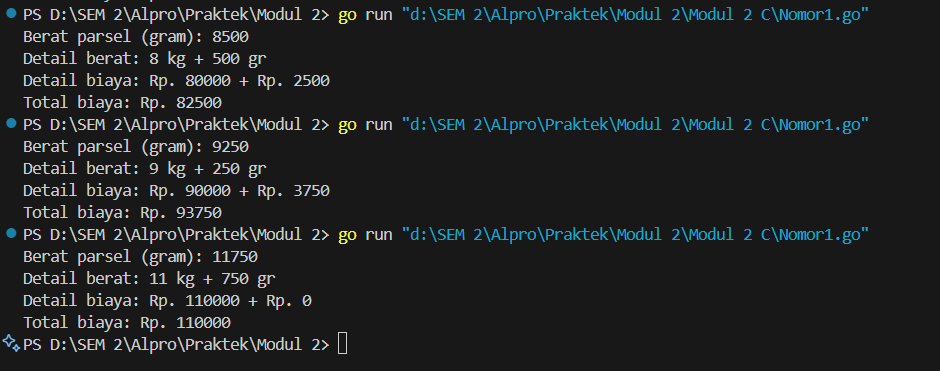

Nomor 2
Code yang salah:
```go
package main

import “fmt”

func main()

 var nam float64

 var nmk string

 fmt.Print(“Nilai akhir mata kuliah: “)

 fmt.Scanln(&nam)

 if nam > 80 {

 nam = “A”

 }

 if nam > 72.5 {

 nam = “AB”

 }

 if nam > 65 {

 nam = “B”

 }

 if nam > 57.5 {

 nam = “BC”

 }

 if nam > 50 {

 nam = “C”

 }

 if nam > 40 {

 nam = “D”

 } else if nam <= 40 {

 nam = “E”

 }

fmt.Println(“Nilai mata kuliah: “, nmk)
```

Code yang benar:
```go
package main

import "fmt"

func main() {

	var nam float64
	var nmk string

	fmt.Print("Nilai akhir mata kuliah: ")
	fmt.Scanln(&nam)

	if nam > 80 {
		nmk = "A"
	} else if nam > 72.5 && nam <= 80 {
		nmk = "AB"
	} else if nam > 65 && nam <= 72.5 {
		nmk = "B"
	} else if nam > 57.5 && nam <= 65 {
		nmk = "BC"
	} else if nam > 50 && nam <= 57.5 {
		nmk = "C"
	} else if nam > 40 && nam <= 50 {
		nmk = "D"
	} else if nam <= 40 {
		nmk = "E"
	}

	fmt.Println("Nilai mata kuliah:", nmk)
}
```

Pertanyaan A:
Ketika program telah dijalankan, output yang muncul  tidak sesuai dengan kriteria. Dikarenakan terdapat beberapa kesalahan pada program yang harus diperbaik
Pertanyaan B:
Program ini memiliki  kesalahan yang menyebabkan hasilnya tidak sesuai dengan yang diharapkan. Pertama, ada kesalahan dalam tipe data, di mana variabel `nam` dideklarasikan sebagai `float64`, tetapi program mencoba menyimpan nilai huruf seperti "A" atau "B" ke dalamnya. Seharusnya, program menggunakan variabel terpisah dengan tipe `string` untuk menyimpan huruf tersebut. Kedua, urutan pengecekan kondisi menggunakan beberapa `if` terpisah tanpa `else if`. Hal ini menyebabkan nilai `nam` terus diperiksa oleh semua kondisi yang ada, sehingga hasil akhirnya bisa berubah dan tidak sesuai dengan yang diharapkan. Solusinya, program sebaiknya menggunakan struktur `if-else if` agar hanya satu kondisi yang dipilih sesuai dengan rentang nilai yang diberikan. Ketiga, terdapat kesalahan dalam penggunaan tanda kutip miring (“”), yang bukan tanda kutip standar (`""`), sehingga bisa menyebabkan error saat kompilasi. Selain itu, penggunaan `fmt.Scanln(&nam)` kurang optimal karena dapat menyebabkan masalah dalam membaca input, terutama jika terdapat spasi. Sebaiknya, program menggunakan `fmt.Scan(&nam)` untuk memastikan input dibaca dengan benar. Agar program berjalan dengan baik, perlu dilakukan perbaikan dalam struktur kondisional, pemisahan tipe data antara angka dan huruf, serta penggunaan sintaks yang sesuai agar tidak terjadi error saat dijalankan.

Pertanyaan C:
Program ini digunakan untuk menentukan nilai huruf berdasarkan nilai akhir mata kuliah yang dimasukkan oleh pengguna. Pertama, program meminta pengguna memasukkan nilai akhir dalam bentuk angka desimal. Nilai tersebut kemudian diperiksa menggunakan beberapa kondisi. Jika nilai lebih dari 80, maka hasilnya adalah "A". Jika lebih dari 72.5, maka mendapat "AB". Untuk nilai lebih dari 65, hasilnya "B", sedangkan nilai lebih dari 57.5 akan menghasilkan "BC". Jika nilai lebih dari 50, maka akan mendapat "C", dan nilai lebih dari 40 akan mendapat "D". Jika nilai 40 atau kurang, maka hasilnya adalah "E". Setelah pemeriksaan selesai, program menampilkan nilai huruf sesuai dengan nilai yang dimasukkan pengguna.

Output:
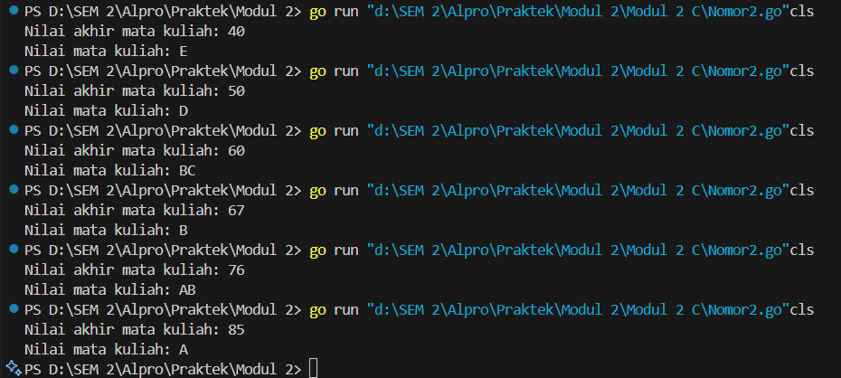


Nomor 3
```go
package main

  

import "fmt"

  

func main() {

    var b int

    fmt.Print("Bilangan: ")

    fmt.Scan(&b)

  

    fmt.Print("Faktor: ")

    count := 0

    for i := 1; i <= b; i++ {

        if b%i == 0 {

            fmt.Print(i, " ")

            count++

        }

    }

    fmt.Println()

  

    if count == 2 {

        fmt.Println("Prima: true")

    } else {

        fmt.Println("Prima: false")

    }

}
```
Penjelasan:
Program ini bertujuan untuk menentukan faktor-faktor dari sebuah bilangan serta mengecek apakah bilangan tersebut merupakan bilangan prima. Program dimulai dengan meminta pengguna memasukkan sebuah bilangan `b`. Setelah menerima input, program menampilkan semua faktor dari `b` dengan melakukan perulangan dari `1` hingga `b` dan memeriksa apakah `b` habis dibagi oleh `i`. Jika iya, `i` dicetak sebagai faktor, dan penghitung `count` ditambah satu. Setelah semua faktor ditemukan, program mengevaluasi apakah jumlah faktor yang ditemukan adalah dua. Jika `count` sama dengan `2`, berarti `b` hanya memiliki faktor `1` dan `b` itu sendiri, sehingga program mencetak `"Prima: true"`, menandakan bahwa bilangan tersebut adalah bilangan prima. Jika jumlah faktornya lebih dari dua, program mencetak `"Prima: false"`, yang berarti bilangan tersebut bukan bilangan prima.

Output:
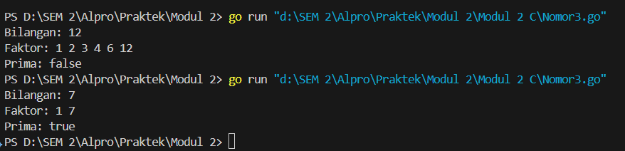
