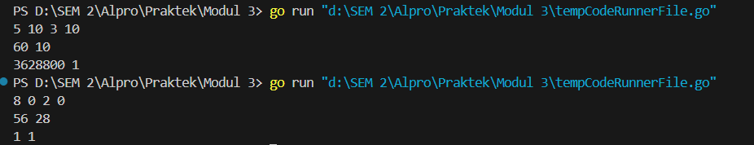
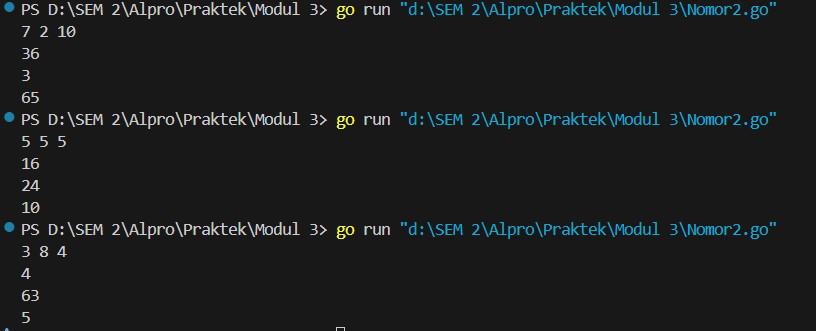
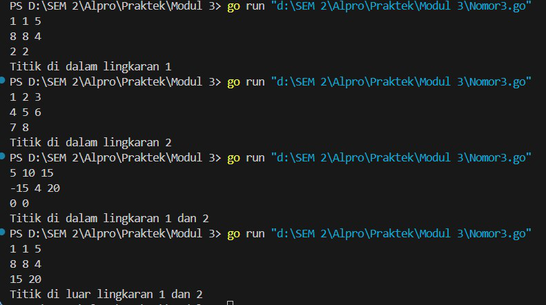

Laporan Praktikum Modul 3


FUNGSI


ADRIAN ERNEST TROY RAWUNG-103112430009

Dasar Teori


Dalam bahasa pemrograman Go, fungsi (function) adalah blok kode yang dapat dieksekusi secara independen untuk meningkatkan modularitas dan reusability. Fungsi dideklarasikan dengan kata kunci func, diikuti oleh nama fungsi, parameter (jika ada), tipe return (jika ada), dan blok kode {} yang berisi instruksi. Go mendukung berbagai jenis fungsi, seperti fungsi tanpa parameter dan return, fungsi dengan parameter untuk menerima input, serta fungsi dengan return value untuk mengembalikan hasil eksekusi. Selain itu, Go memungkinkan multiple return, yang dapat mengembalikan lebih dari satu nilai sekaligus, serta fungsi variadic yang dapat menerima jumlah parameter yang tidak tetap. Penggunaan fungsi dalam Go membantu membuat kode lebih terstruktur, mudah dibaca, dan lebih mudah untuk diuji atau diperbaiki, sehingga meningkatkan efisiensi pengembangan perangkat lunak.

Unguided


Nomor 1
```go
package main
  

import "fmt"


func factorial(n int) (f int) {

    f = 1

    for i := 2; i <= n; i++ {

        f *= i

    }

    return

}


func perm(n, r int) int {

    if n < r {

        return 0

    }

    return factorial(n) / factorial(n-r)

}

  

func comb(n, r int) int {

    if n < r {

        return 0

    }

    return perm(n, r) / factorial(r)

}

  

func main() {

    var a, b, c, d int

    fmt.Scan(&a, &b, &c, &d)

  

    if a >= c && b >= d {

        fmt.Println(perm(a, c), comb(a, c))

        fmt.Println(perm(b, d), comb(b, d))

    }

}
```

Penjelasan :

Program ini dibuat buat ngitung **permutasi** dan **kombinasi** dari angka yang dikasih pengguna. Pertama, ada fungsi `factorial(n int)`, yang tugasnya buat ngitung faktorial, yaitu hasil kali semua angka dari 1 sampai `n`. Faktorial ini penting karena bakal dipakai di perhitungan permutasi dan kombinasi.

Terus, ada fungsi `perm(n, r int)`, yang dipakai buat ngitung **permutasi**. Permutasi ini intinya cara nyusun `r` benda dari `n` benda dengan urutan yang diperhitungkan. Rumusnya `P(n, r) = n! / (n-r)!`. Kalau `n` lebih kecil dari `r`, hasilnya `0`, karena nggak mungkin milih lebih banyak dari yang tersedia. Lalu, ada fungsi `comb(n, r int)`, yang gunanya buat ngitung **kombinasi**. Kombinasi ini mirip permutasi, tapi urutan nggak diperhitungkan. Rumusnya `C(n, r) = P(n, r) / r!`, yang juga bisa ditulis `C(n, r) = n! / (r!(n-r)!)`.

Di bagian utama (`main()`), program bakal baca empat angka dari input (`a, b, c, d`). Abis itu dicek dulu, kalau `a >= c` dan `b >= d`, baru deh program ngitung permutasi dan kombinasi buat masing-masing pasangan angka itu. Misalnya, kalau input yang dikasih itu `5 6 3 2`, program bakal ngeluarin `60 10` dan `30 15`. Itu karena `P(5,3) = 60`, `C(5,3) = 10`, `P(6,2) = 30`, dan `C(6,2) = 15`.

Singkatnya, program ini bisa bantu buat ngitung kombinasi dan permutasi dengan cepat berdasarkan input yang dikasih. Simpel, tapi lumayan berguna buat perhitungan kayak gini.

Output :



Nomor 2
```go
package main

  

import "fmt"

  

func f(x int) int { return x * x }

func g(x int) int { return x - 2 }

func h(x int) int { return x + 1 }

  

func main() {

    var a, b, c int

    if _, err := fmt.Scan(&a, &b, &c); err != nil {

        fmt.Println("Input error")

        return

    }

  

    fmt.Println(f(g(h(a))))

    fmt.Println(g(h(f(b))))

    fmt.Println(h(f(g(c))))

}
```
Penjelasan :

Program ini membaca tiga angka dari input pengguna dan kemudian menerapkan tiga fungsi matematika (`f`, `g`, dan `h`) dalam berbagai kombinasi pada masing-masing angka. Fungsi `f(x)` mengembalikan kuadrat dari `x`, fungsi `g(x)` mengurangi `2` dari `x`, dan fungsi `h(x)` menambahkan `1` ke `x`. Setelah input dibaca, program mengecek apakah proses pembacaan berhasil. Jika terjadi kesalahan saat membaca input, program akan mencetak "Input error" dan berhenti. Jika tidak ada masalah, program akan mencetak hasil dari tiga operasi berurutan: `f(g(h(a)))`, `g(h(f(b)))`, dan `h(f(g(c))))`, yang berarti fungsi `h` dijalankan terlebih dahulu pada `a`, kemudian hasilnya diberikan ke `g`, lalu hasil akhirnya dimasukkan ke `f`, dan begitu juga untuk `b` dan `c` sesuai urutannya. Program ini sederhana tetapi menunjukkan bagaimana fungsi dapat dikomposisikan untuk membentuk operasi yang lebih kompleks.

Output:




Nomor 3
```go
package main

  

import "fmt"

  

func jarak(a, b, c, d float64) float64 {

    return (a-c)*(a-c) + (b-d)*(b-d)

}

  

func didalam(cx, cy, r, x, y float64) int {

    if jarak(cx, cy, x, y) <= r*r {

        return 1

    }

    return 0

}

  

func main() {

    var cx1, cy1, r1, cx2, cy2, r2, x, y float64

    fmt.Scan(&cx1, &cy1, &r1, &cx2, &cy2, &r2, &x, &y)

  

    pos := didalam(cx1, cy1, r1, x, y)<<1 | didalam(cx2, cy2, r2, x, y)

  

    switch pos {

    case 3:

        fmt.Println("Titik di dalam lingkaran 1 dan 2")

    case 2:

        fmt.Println("Titik di dalam lingkaran 1")

    case 1:

        fmt.Println("Titik di dalam lingkaran 2")

    default:

        fmt.Println("Titik di luar lingkaran 1 dan 2")

    }

}
```

Penjelasan :

Program ini dibuat untuk mengecek apakah sebuah titik berada di dalam dua lingkaran atau tidak. Cara kerjanya, pertama-tama program membaca input berupa koordinat pusat dan jari-jari dua lingkaran (`cx1, cy1, r1` untuk lingkaran pertama dan `cx2, cy2, r2` untuk lingkaran kedua), serta koordinat titik yang ingin diperiksa (`x, y`).

Fungsi `jarak(a, b, c, d)` digunakan untuk menghitung kuadrat jarak antara dua titik `(a, b)` dan `(c, d)`, tanpa menggunakan akar kuadrat supaya lebih efisien. Kemudian, fungsi `didalam(cx, cy, r, x, y)` akan mengecek apakah titik `(x, y)` berada dalam lingkaran yang berpusat di `(cx, cy)` dengan jari-jari `r`. Jika iya, fungsi ini mengembalikan `1`, kalau tidak `0`.

Di dalam `main()`, program menghitung dua nilai `didalam()` untuk kedua lingkaran dan menggabungkannya dalam variabel `pos`. Caranya, hasil dari lingkaran pertama digeser ke kiri (`<<1`) dan hasil dari lingkaran kedua digabung dengan operator `|` (bitwise OR). Ini menghasilkan angka `3` jika titik ada di kedua lingkaran, `2` jika hanya di lingkaran pertama, `1` jika hanya di lingkaran kedua, dan `0` jika titik berada di luar keduanya.

Terakhir, program menggunakan `switch case` untuk mencetak hasil sesuai dengan posisi titik. Jika `pos` bernilai `3`, berarti titik ada di dalam kedua lingkaran. Jika `pos` `2`, titik hanya ada di dalam lingkaran pertama. Jika `pos` `1`, titik hanya ada di dalam lingkaran kedua. Jika `pos` `0`, berarti titik ada di luar kedua lingkaran.

Program ini cukup efisien karena tidak perlu menggunakan perhitungan akar kuadrat dan hanya menggunakan operasi sederhana untuk menentukan posisi titik.

Output:


