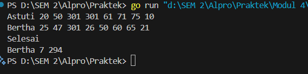

Modul 4

Nama : Adrian Ernest Troy Rawung
NIM : 103112430009
Kelas: IF-05

Nomor 1.
```go
package main

  

import "fmt"

  

func factorial(n int) (hasil int) {

    hasil = 1

    for i := 2; i <= n; i++ {

        hasil *= i

    }

    return

}

  

func permutation(n, r int) int {

    return factorial(n) / factorial(n-r)

}

  

func combination(n, r int) int {

    return permutation(n, r) / factorial(r)

}

  

func main() {

    var a, b, c, d int

    fmt.Scan(&a, &b, &c, &d)

    fmt.Println(permutation(a, c), combination(a, c))

    fmt.Println(permutation(b, d), combination(b, d))

}
```
Penjelasan:
Kode di atas adalah program dalam Golang yang menghitung **permusasi** dan **kombinasi** dari dua pasang bilangan yang diberikan sebagai input. Fungsi `factorial(n int)` menghitung faktorial dari `n` menggunakan perulangan. Fungsi `permutation(n, r int)` menghitung permutasi dengan rumus `n! / (n-r)!`, sementara fungsi `combination(n, r int)` menghitung kombinasi dengan rumus `P(n, r) / r!`. Program membaca empat bilangan `a, b, c, d` sebagai input, lalu mencetak hasil permutasi dan kombinasi untuk `(a, c)` dan `(b, d)`. Kode ini sederhana dan efisien untuk menghitung permutasi serta kombinasi dalam skala kecil.

Output:


Nomor 2.
```go
package main

  

import (

    "fmt"

)

  

func hitungSkor(waktu [8]int) (int, int) {

    const batasWaktu = 301

    soal, total := 0, 0

  

    for _, t := range waktu {

        if t < batasWaktu {

            soal++

            total += t

        }

    }

    return soal, total

}

  

func main() {

    var nama, pemenang string

    var waktu [8]int

    maxSoal, minWaktu := 0, 0

  

    for {

        fmt.Scan(&nama)

        if nama == "selesai" || nama == "Selesai" {

            break

        }

  

        for i := range waktu {

            fmt.Scan(&waktu[i])

        }

  

        soal, total := hitungSkor(waktu)

  

        if soal > maxSoal || (soal == maxSoal && total < minWaktu) {

            pemenang, maxSoal, minWaktu = nama, soal, total

        }

    }

  

    fmt.Println(pemenang, maxSoal, minWaktu)

}
```
Penjelasan:
Kode di atas adalah program dalam Golang yang menentukan pemenang dalam sebuah kompetisi pemrograman berdasarkan jumlah soal yang diselesaikan dan waktu yang dihabiskan. Fungsi `hitungSkor` menghitung jumlah soal yang diselesaikan dalam batas waktu 301 menit serta total waktu yang dihabiskan. Dalam fungsi `main`, program membaca nama peserta dan waktu penyelesaian untuk 8 soal. Jika peserta menyelesaikan lebih banyak soal atau menyelesaikan jumlah soal yang sama dalam waktu lebih singkat, maka mereka dianggap sebagai pemenang. Proses ini berulang hingga input "selesai" diberikan, lalu program mencetak nama pemenang, jumlah soal yang diselesaikan, dan total waktu yang digunakan.


Output:



Nomor 3.

```go
package main

  

import "fmt"

  

func cetakDeret(n int) {

    for fmt.Print(n, " "); n != 1; {

        if n%2 == 0 {

            n /= 2

        } else {

            n = 3*n + 1

        }

        fmt.Print(n, " ")

    }

    fmt.Println()

}

  

func main() {

    var n int

    fmt.Scan(&n)

    if n > 1 && n < 1000000 {

        cetakDeret(n)

    }

}
```
Penjelasan:
Kode di atas adalah program dalam Golang yang mencetak deret bilangan berdasarkan aturan Collatz (3n + 1). Fungsi `cetakDeret` menerima sebuah bilangan `n`, kemudian mencetak deret hingga mencapai angka 1. Jika `n` genap, maka dibagi 2; jika ganjil, maka dikalikan 3 lalu ditambah 1. Proses ini berulang hingga `n` bernilai 1. Fungsi `main` membaca input `n`, memastikan nilainya antara 2 hingga kurang dari 1.000.000, lalu memanggil `cetakDeret` untuk mencetak hasilnya.


Output:
