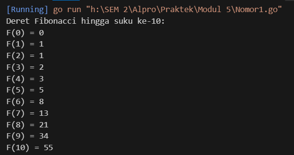
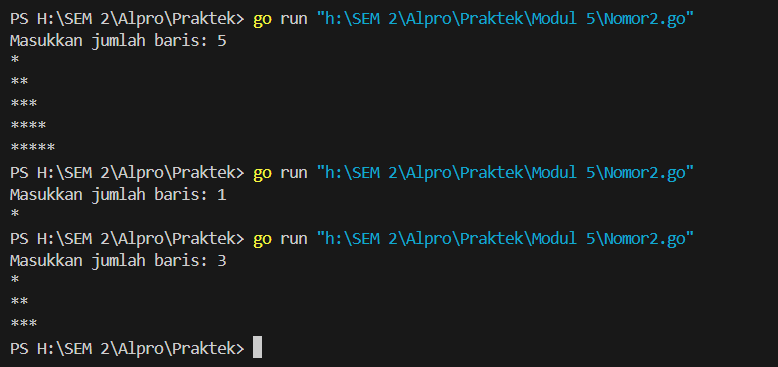
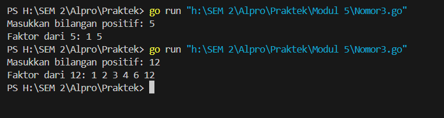
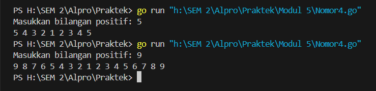
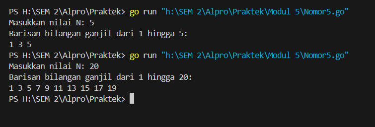
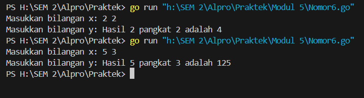

Modul 4

Nama : Adrian Ernest Troy Rawung
NIM : 103112430009
Kelas: IF-05

Nomor 1

```go
package main

import (

    "fmt"

)

  
func fibonacci(n int) int {

    if n == 0 {

        return 0

    } else if n == 1 {

        return 1

    } else {

        return fibonacci(n-1) + fibonacci(n-2)

    }

}

  

func main() {

    fmt.Println("Deret Fibonacci hingga suku ke-10:")

    for i := 0; i <= 10; i++ {

        fmt.Printf("F(%d) = %d\n", i, fibonacci(i))

    }

}
```
Penjelasan:
Program ini dibuat untuk menampilkan deret Fibonacci hingga suku ke-10 dengan menggunakan bahasa Go. Kodenya dimulai dengan mendefinisikan package `main`, yang diperlukan agar program bisa dijalankan. Selanjutnya, ada import package `fmt`, yang berguna untuk mencetak teks ke layar. Bagian inti dari program ini adalah fungsi `fibonacci(n int)`, yang berfungsi menghitung bilangan Fibonacci ke-`n`. Fungsi ini menggunakan pendekatan rekursif, artinya fungsi akan memanggil dirinya sendiri sampai mencapai hasil akhir. Ada dua kasus dasar (basis kasus) dalam fungsi ini: kalau `n` bernilai 0, fungsi akan mengembalikan angka 0, dan kalau `n` bernilai 1, fungsi akan mengembalikan angka 1. Kalau `n` lebih besar dari 1, fungsi akan menghitung dengan menjumlahkan hasil dari `fibonacci(n-1)` dan `fibonacci(n-2)`.

Setelah itu, pada fungsi `main`, program mencetak judul "Deret Fibonacci hingga suku ke-10" untuk memberi tahu pengguna apa yang akan ditampilkan. Lalu, ada perulangan `for` yang berjalan dari angka 0 sampai 10. Di dalam perulangan ini, program memanggil fungsi `fibonacci(i)` untuk menghitung bilangan Fibonacci ke-`i` dan mencetak hasilnya dengan format `F(i) = hasil`. Hasil akhirnya akan menampilkan deret Fibonacci dari suku ke-0 sampai ke-10, yaitu: 0, 1, 1, 2, 3, 5, 8, 13, 21, 34, dan 55. Fungsi rekursif ini mengikuti aturan dasar deret Fibonacci, di mana setiap bilangan dalam deret merupakan hasil penjumlahan dari dua bilangan sebelumnya. Dengan pendekatan sederhana ini, program berhasil menghasilkan deret Fibonacci yang sesuai dengan logika matematika dasar Fibonacci.

Output:



Nomor 2

```go
package main

  

import (

    "fmt"

)

  

func printStars(n int) {

    if n > 0 {

        fmt.Print("*")

        printStars(n - 1)

    }

}

  

func printPattern(n, i int) {

    if i <= n {

        printStars(i)

        fmt.Println()

        printPattern(n, i+1) /

    }

}

  

func main() {

    var n int

    fmt.Print("Masukkan jumlah baris: ")

    fmt.Scan(&n)

  

    printPattern(n, 1)

}
```
Penjelasan:
Kode di atas adalah program dalam bahasa Go yang menampilkan pola bintang bertingkat menggunakan fungsi rekursif. Program ini terdiri dari dua fungsi utama: `printStars` dan `printPattern`. Fungsi `printStars(n int)` digunakan untuk mencetak sebanyak `n` bintang secara rekursif, dengan setiap pemanggilan mencetak satu bintang dan kemudian memanggil dirinya sendiri dengan nilai `n-1` hingga `n` bernilai nol. Fungsi `printPattern(n, i int)` bertugas mencetak pola bintang bertingkat dengan `i` mewakili jumlah bintang yang akan dicetak di baris tersebut. Fungsi ini mencetak `i` bintang dengan memanggil `printStars(i)` dan menambahkan baris baru menggunakan `fmt.Println()`. Selanjutnya, fungsi akan memanggil dirinya sendiri dengan `i+1` hingga `i` lebih besar dari `n`. Di dalam fungsi `main`, program meminta input pengguna untuk menentukan jumlah baris pola, lalu memanggil fungsi `printPattern` dengan parameter awal `i = 1`. Program ini menciptakan pola bertingkat dari satu bintang di baris pertama hingga `n` bintang di baris terakhir.


Output:



Nomor 3

```go
package main

  

import (

    "fmt"

)

  

func printFactors(n, i int) {

    if i > n {

        return /

    }

    if n%i == 0 {

        fmt.Printf("%d ", i)

    }

    printFactors(n, i+1) /

}

  

func main() {

    var n int

    fmt.Print("Masukkan bilangan positif: ")

    fmt.Scan(&n)

  

    fmt.Printf("Faktor dari %d: ", n)

    printFactors(n, 1)

    fmt.Println()

}
```
Penjelasan:
Kode di atas adalah program dalam bahasa Go yang berfungsi untuk mencetak semua faktor dari bilangan positif `n` menggunakan rekursi. Program ini terdiri dari fungsi utama `printFactors` dan fungsi `main`. Fungsi `printFactors(n, i int)` mencetak faktor-faktor bilangan `n` dengan cara mengecek apakah `n` habis dibagi oleh `i`. Jika `n % i == 0`, maka `i` adalah faktor dari `n` dan akan dicetak. Fungsi ini dipanggil secara rekursif dengan nilai `i+1` hingga nilai `i` melebihi `n`, yang akan menghentikan rekursi. Di dalam fungsi `main`, program meminta input bilangan positif `n` dari pengguna dan memanggil fungsi `printFactors(n, 1)` untuk mencetak semua faktor `n` dari 1 hingga `n`. Output program menampilkan bilangan-bilangan yang menjadi faktor dari input tersebut.

Output:


Nomor 4

```go
package main

  

import "fmt"

  

func printDescending(n int) {

    if n < 1 {

        return

    }

    fmt.Printf("%d ", n)

    printDescending(n - 1)

}

  

func printAscending(n, current int) {

    if current > n {

        return

    }

    fmt.Printf("%d ", current)

    printAscending(n, current+1)

}

  

func main() {

    var n int

    fmt.Print("Masukkan bilangan positif: ")

    fmt.Scan(&n)

    printDescending(n)

    printAscending(n, 2)

    fmt.Println()

}
```
Penjelasan:
Kode di atas adalah program dalam bahasa Go yang mencetak bilangan secara menurun dari `n` hingga 1, lalu mencetak bilangan secara naik dari 2 hingga `n`. Program ini menggunakan dua fungsi rekursif: `printDescending` dan `printAscending`. Fungsi `printDescending(n int)` akan mencetak bilangan `n` dan memanggil dirinya sendiri dengan parameter `n-1` hingga nilai `n` kurang dari 1, yang menghentikan rekursi. Setelah itu, fungsi `printAscending(n, current int)` mencetak bilangan dari `current` hingga `n`. Rekursi berhenti ketika `current` melebihi `n`. Di dalam fungsi `main`, program meminta input bilangan positif `n` dari pengguna. Kemudian, `printDescending(n)` mencetak bilangan secara menurun, dan `printAscending(n, 2)` mencetak bilangan dari 2 hingga `n` setelahnya. Akhirnya, `fmt.Println()` mencetak baris baru setelah output angka.

Output:


Nomor 5

```go
package main

  

import (

    "fmt"

)

  

func printOddNumbers(n, current int) {

    if current > n {

        return

    }

    if current%2 != 0 {

        fmt.Print(current, " ")

    }

    printOddNumbers(n, current+1)

}

  

func main() {

    var n int

    fmt.Print("Masukkan nilai N: ")

    fmt.Scan(&n)

    fmt.Printf("Barisan bilangan ganjil dari 1 hingga %d:\n", n)

    printOddNumbers(n, 1)

    fmt.Println()

}
```
Penjelasan:
Kode di atas adalah program Go yang mencetak barisan bilangan ganjil dari 1 hingga bilangan positif `n` yang dimasukkan oleh pengguna. Fungsi utama dalam program ini adalah `printOddNumbers(n, current)` yang menggunakan rekursi. Fungsi tersebut mencetak bilangan ganjil secara berurutan dari `current` hingga `n`. Jika `current` melebihi `n`, fungsi akan berhenti (return). Di setiap pemanggilan rekursif, program memeriksa apakah `current` adalah bilangan ganjil dengan menggunakan operasi modulus (`current % 2 != 0`), dan jika benar, angka tersebut dicetak. Fungsi `main` meminta input bilangan `n` dari pengguna, lalu memanggil `printOddNumbers(n, 1)` untuk mencetak bilangan ganjil mulai dari 1. Setelah mencetak barisan, program menyisipkan baris baru dengan `fmt.Println()`.

Output:


Nomor 6

```go
package main

  

import "fmt"

  

func power(x int, y int) int {

    if y == 0 {

        return 1

    }

    return x * power(x, y-1)

}

  

func main() {

    var x, y int

    fmt.Print("Masukkan bilangan x: ")

    fmt.Scan(&x)

    fmt.Print("Masukkan bilangan y: ")

    fmt.Scan(&y)

    result := power(x, y)

    fmt.Printf("Hasil %d pangkat %d adalah %d\n", x, y, result)

}
```
Penjelasan:
Kode di atas adalah program Go yang menghitung hasil perpangkatan bilangan `x` dipangkatkan `y` menggunakan fungsi rekursif. Fungsi `power(x, y)` bertanggung jawab untuk melakukan operasi tersebut. Jika nilai `y` sama dengan 0, fungsi akan mengembalikan 1, karena bilangan apa pun yang dipangkatkan 0 hasilnya adalah 1. Jika `y` lebih dari 0, fungsi akan mengembalikan hasil perkalian `x` dengan pemanggilan rekursif `power(x, y-1)` hingga nilai `y` mencapai 0. Fungsi `main` meminta input dua bilangan bulat `x` dan `y` dari pengguna, kemudian memanggil fungsi `power` untuk menghitung hasil perpangkatannya. Hasil akhirnya ditampilkan dengan format output yang menyatakan hasil `x` pangkat `y`. Program ini menggambarkan konsep rekursi dengan mengurangi nilai pangkat secara bertahap hingga mencapai basis rekursi, yaitu `y == 0`.

Output:
