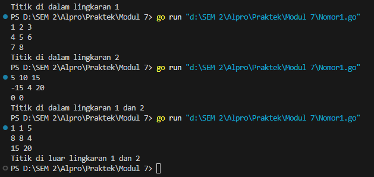
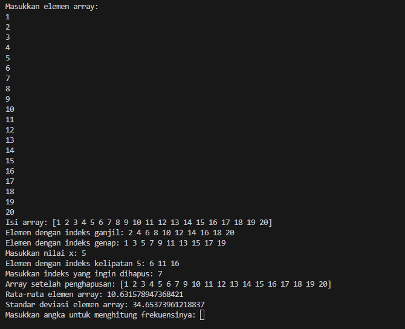
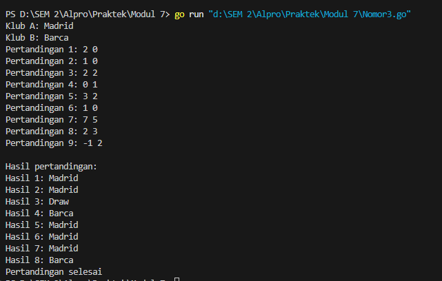
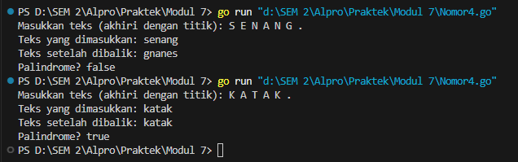

MODUL 7

Nama : Adrian Ernest Troy Rawung
Kelas : IF-12-05
NIM : 103112430009

Nomor 1
```go
package main

  

import (

    "fmt"

)

  

type Titik struct {

    x, y int

}

  

type Lingkaran struct {

    pusat  Titik

    radius int

}

  

func dalamLingkaran(c Lingkaran, p Titik) bool {

    dx, dy := p.x-c.pusat.x, p.y-c.pusat.y

    return dx*dx+dy*dy <= c.radius*c.radius

}

  

func main() {

    var c1, c2 Lingkaran

    var t Titik

  

    fmt.Scan(&c1.pusat.x, &c1.pusat.y, &c1.radius)

    fmt.Scan(&c2.pusat.x, &c2.pusat.y, &c2.radius)

    fmt.Scan(&t.x, &t.y)

  

    in1, in2 := dalamLingkaran(c1, t), dalamLingkaran(c2, t)

  

    switch {

    case in1 && in2:

        fmt.Println("Titik di dalam lingkaran 1 dan 2")

    case in1:

        fmt.Println("Titik di dalam lingkaran 1")

    case in2:

        fmt.Println("Titik di dalam lingkaran 2")

    default:

        fmt.Println("Titik di luar lingkaran 1 dan 2")

    }

}
```
Penjelasan :
Program ini menentukan apakah sebuah titik berada di dalam satu atau dua lingkaran berdasarkan koordinatnya. Program mendefinisikan tipe data `Titik` untuk menyimpan koordinat `(x, y)` dan `Lingkaran` untuk menyimpan pusat lingkaran (`Titik`) dan jari-jari (`radius`). Fungsi [dalamLingkaran](vscode-file://vscode-app/c:/Users/Adrian%20Ernest/AppData/Local/Programs/Microsoft%20VS%20Code/resources/app/out/vs/code/electron-sandbox/workbench/workbench.html) menghitung jarak kuadrat antara titik dan pusat lingkaran, lalu membandingkannya dengan kuadrat jari-jari untuk menentukan apakah titik berada di dalam lingkaran. Di fungsi [main](vscode-file://vscode-app/c:/Users/Adrian%20Ernest/AppData/Local/Programs/Microsoft%20VS%20Code/resources/app/out/vs/code/electron-sandbox/workbench/workbench.html), program membaca data dua lingkaran dan satu titik dari input, lalu menggunakan fungsi [dalamLingkaran](vscode-file://vscode-app/c:/Users/Adrian%20Ernest/AppData/Local/Programs/Microsoft%20VS%20Code/resources/app/out/vs/code/electron-sandbox/workbench/workbench.html) untuk memeriksa posisi titik relatif terhadap kedua lingkaran. Hasilnya dicetak sesuai dengan kondisi: di dalam lingkaran pertama, kedua, keduanya, atau di luar keduanya.

Output :



Nomor 2
```go
package main

  

import "fmt"

  

func main() {

    var n int

    fmt.Print("Masukkan jumlah elemen dalam array: ")

    fmt.Scan(&n)

  

    arr := make([]int, n)

    fmt.Println("Masukkan elemen array:")

    for i := 0; i < n; i++ {

        fmt.Scan(&arr[i])

    }

  

    fmt.Println("Isi array:", arr)

  

    fmt.Print("Elemen dengan indeks ganjil: ")

    for i := 1; i < n; i += 2 {

        fmt.Print(arr[i], " ")

    }

    fmt.Println()

  

    fmt.Print("Elemen dengan indeks genap: ")

    for i := 0; i < n; i += 2 {

        fmt.Print(arr[i], " ")

    }

    fmt.Println()

  

    var x int

    fmt.Print("Masukkan nilai x: ")

    fmt.Scan(&x)

    fmt.Print("Elemen dengan indeks kelipatan ", x, ": ")

    for i := x; i < n; i += x {

        fmt.Print(arr[i], " ")

    }

    fmt.Println()

  

    var index int

    fmt.Print("Masukkan indeks yang ingin dihapus: ")

    fmt.Scan(&index)

    if index >= 0 && index < n {

        arr = append(arr[:index], arr[index+1:]...)

        fmt.Println("Array setelah penghapusan:", arr)

    } else {

        fmt.Println("Indeks tidak valid.")

    }

  

    sum := 0

    for _, val := range arr {

        sum += val

    }

    rata := float64(sum) / float64(len(arr))

    fmt.Println("Rata-rata elemen array:", rata)

  

    var variance float64

    for _, val := range arr {

        variance += (float64(val) - rata) * (float64(val) - rata)

    }

    stdDeviasi := variance / float64(len(arr))

    fmt.Println("Standar deviasi elemen array:", stdDeviasi)

  

    var target int

    fmt.Print("Masukkan angka untuk menghitung frekuensinya: ")

    fmt.Scan(&target)

    count := 0

    for _, val := range arr {

        if val == target {

            count++

        }

    }

    fmt.Println("Frekuensi angka", target, "dalam array adalah:", count)

}
```
Penjelasan:
Program ini melakukan berbagai operasi pada array integer berdasarkan input pengguna. Pertama, pengguna diminta memasukkan jumlah elemen dan nilai-nilai array. Program menampilkan elemen dengan indeks ganjil, genap, dan kelipatan nilai tertentu ([x](vscode-file://vscode-app/c:/Users/Adrian%20Ernest/AppData/Local/Programs/Microsoft%20VS%20Code/resources/app/out/vs/code/electron-sandbox/workbench/workbench.html)). Selanjutnya, pengguna dapat menghapus elemen pada indeks tertentu, dan array diperbarui. Program juga menghitung rata-rata, standar deviasi, dan frekuensi kemunculan angka tertentu dalam array. Semua hasil ditampilkan untuk memberikan informasi lengkap tentang array yang dimasukkan.

Output:


Nomor 3
```go
package main

  

import "fmt"

  

func main() {

    var clubA, clubB string

    fmt.Print("Klub A: ")

    fmt.Scan(&clubA)

    fmt.Print("Klub B: ")

    fmt.Scan(&clubB)

  

    var winners []string

    matchNum := 1

  

    for {

        var scoreA, scoreB int

        fmt.Printf("Pertandingan %d: ", matchNum)

        fmt.Scan(&scoreA, &scoreB)

  

        if scoreA < 0 || scoreB < 0 {

            break

        }

  

        if scoreA > scoreB {

            winners = append(winners, clubA)

        } else if scoreA < scoreB {

            winners = append(winners, clubB)

        } else {

            winners = append(winners, "Draw")

        }

  

        matchNum++

    }

  

    fmt.Println("\nHasil pertandingan:")

    for i, winner := range winners {

        fmt.Printf("Hasil %d: %s\n", i+1, winner)

    }

  

    fmt.Println("Pertandingan selesai")

}
```
Penjelasan:
Program ini mencatat hasil pertandingan antara dua klub sepak bola berdasarkan skor yang dimasukkan pengguna. Pengguna diminta memasukkan nama kedua klub, lalu memasukkan skor untuk setiap pertandingan secara berulang. Jika skor klub A lebih besar, klub A dinyatakan sebagai pemenang; jika skor klub B lebih besar, klub B menjadi pemenang; dan jika skornya sama, hasilnya adalah "Draw". Proses ini berlanjut hingga pengguna memasukkan skor negatif, yang menandakan akhir input. Program kemudian menampilkan hasil setiap pertandingan dan mengakhiri dengan pesan bahwa pertandingan selesai.

Output:


Nomor 4
```go
package main

  

import (

    "bufio"

    "fmt"

    "os"

    "unicode"

)

  

const NMAX int = 127

  

type tabel [NMAX]rune

  

func isiArray(t *tabel, n *int) {

    reader := bufio.NewReader(os.Stdin)

    fmt.Print("Masukkan teks (akhiri dengan titik): ")

    input, _ := reader.ReadString('.')

  

    *n = 0 

    for _, char := range input {

        if unicode.IsLetter(char) { 

            t[*n] = unicode.ToLower(char) 

            *n++

        }

    }

}

  

func cetakArray(t tabel, n int) {

    for i := 0; i < n; i++ {

        fmt.Print(string(t[i]))

    }

    fmt.Println()

}

  

func balikkanArray(t *tabel, n int) {

    for i := 0; i < n/2; i++ {

        t[i], t[n-1-i] = t[n-1-i], t[i]

    }

}

  

func palindrome(t tabel, n int) bool {

    for i := 0; i < n/2; i++ {

        if t[i] != t[n-1-i] {

            return false

        }

    }

    return true

}

  

func main() {

    var tab tabel

    var m int

  

    isiArray(&tab, &m)

  

    fmt.Print("Teks yang dimasukkan: ")

    cetakArray(tab, m)

  

    balikkanArray(&tab, m)

    fmt.Print("Teks setelah dibalik: ")

    cetakArray(tab, m)

  

    if palindrome(tab, m) {

        fmt.Println("Palindrome? true")

    } else {

        fmt.Println("Palindrome? false")

    }

}
```
Penjelasan:
Program ini memeriksa apakah sebuah teks merupakan palindrome, yaitu teks yang terbaca sama dari depan maupun belakang. Pengguna diminta memasukkan teks yang diakhiri dengan tanda titik (`.`). Program hanya memproses huruf, mengabaikan karakter lain, dan mengubah semua huruf menjadi huruf kecil. Teks yang dimasukkan ditampilkan, kemudian dibalik, dan hasilnya juga ditampilkan. Program menggunakan fungsi untuk memeriksa apakah teks yang telah difilter adalah palindrome, lalu mencetak hasilnya sebagai `true` atau `false`.

Output:
